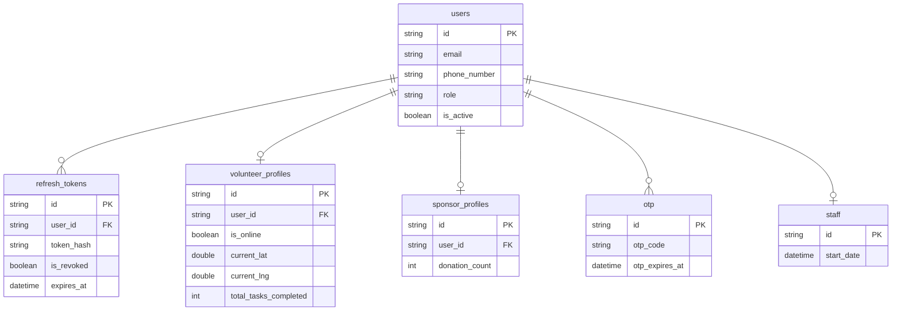
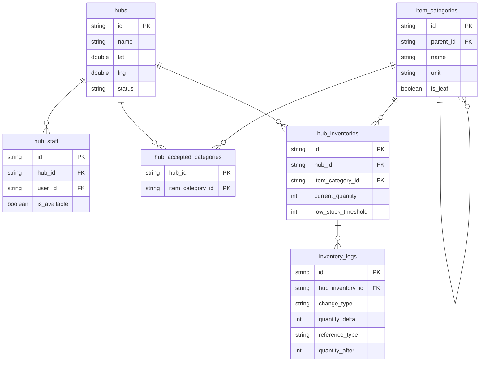
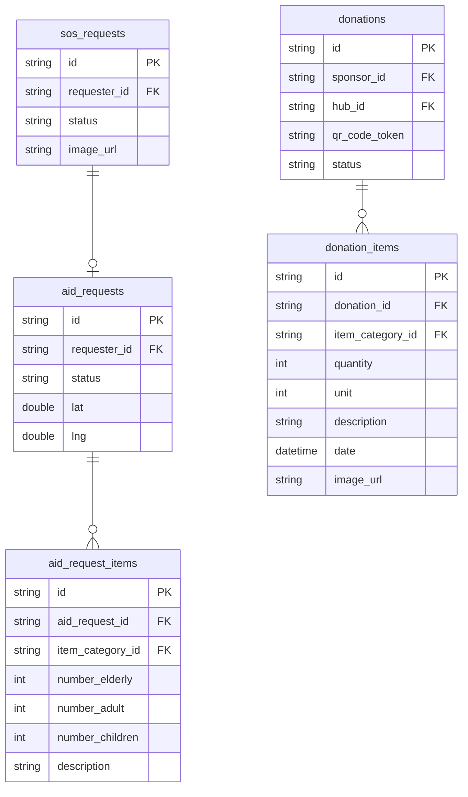
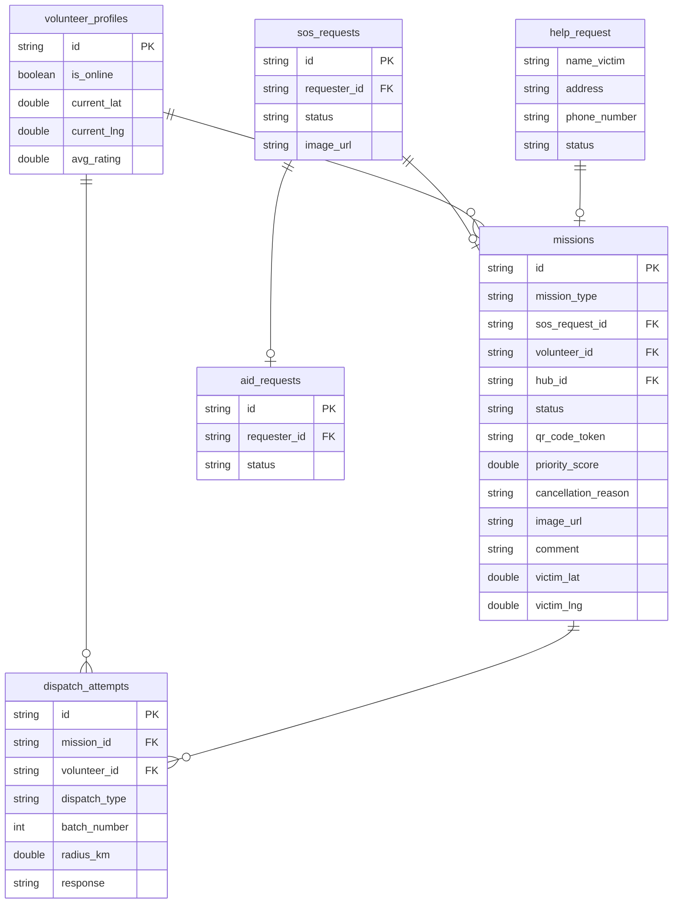
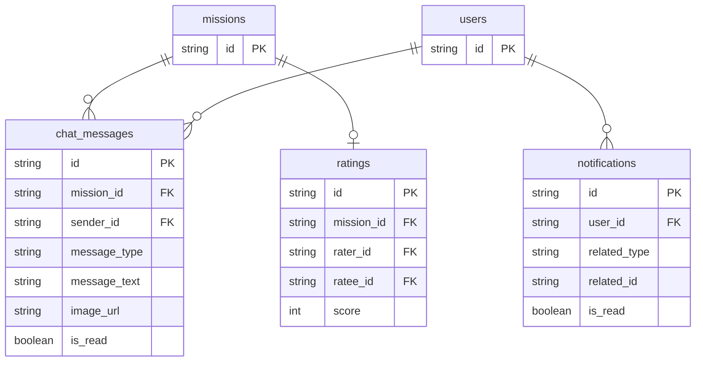

# AidBridge — ERD v3.0

> **Engine:** PostgreSQL 15+ · **Extension:** `uuid-ossp`
> **22 bảng · 10 ENUM · ~35 index**
> **Nguyên tắc:** lat/lng DECIMAL(9,6) (không PostGIS), image_url VARCHAR trực tiếp trong bảng, OTP gộp vào `users`.

---

## 1. Schema Groups

| Group                   | Bảng                                                                              |
| ----------------------- | --------------------------------------------------------------------------------- |
| **Auth**                | `users`, `refresh_tokens`                                                         |
| **Profiles**            | `volunteer_profiles`, `sponsor_profiles`                                          |
| **Infrastructure**      | `hubs`, `hub_staff`, `shelters`, `system_config`                                  |
| **Catalog & Inventory** | `item_categories`, `hub_accepted_categories`, `hub_inventories`, `inventory_logs` |
| **Requests**            | `sos_requests`, `aid_requests`, `aid_request_items`                               |
| **Donations**           | `donations`, `donation_items`                                                     |
| **Missions**            | `missions`, `dispatch_attempts`                                                   |
| **Communication**       | `chat_messages`, `ratings`, `notifications`                                       |

---

## 2. Full ERD

```mermaid
erDiagram
    %% AUTH
    users {
        string id PK
        string full_name
        string email
        string phone_number
        string password_hash
        string role
        boolean is_verified
        boolean is_active
        string fcm_token
        string avatar_url
        string otp_code
        string otp_type
        datetime otp_expires_at
        datetime created_at
        datetime updated_at
    }

    refresh_tokens {
        string id PK
        string user_id FK
        string token_hash
        string device_info
        datetime expires_at
        boolean is_revoked
        datetime created_at
    }

    %% PROFILES
    volunteer_profiles {
        string id PK
        string user_id FK
        boolean is_online
        double current_lat
        double current_lng
        string vehicle_type
        int total_tasks_completed
        double avg_rating
        int avg_response_seconds
        datetime created_at
        datetime updated_at
    }

    sponsor_profiles {
        string id PK
        string user_id FK
        int total_points
        int total_items_donated
        int donation_count
        string badge_level
        datetime created_at
        datetime updated_at
    }

    %% INFRASTRUCTURE
    hubs {
        string id PK
        string name
        string address
        double lat
        double lng
        string status
        string contact_phone
        datetime created_at
        datetime updated_at
    }

    hub_staff {
        string id PK
        string hub_id FK
        string user_id FK
        boolean is_available
        datetime assigned_at
        datetime unassigned_at
    }

    shelters {
        string id PK
        string name
        string address
        double lat
        double lng
        int current_capacity
        int max_capacity
        boolean has_electricity
        boolean has_clean_water
        string status
        datetime created_at
        datetime updated_at
    }

    system_config {
        string key PK
        string value
        string description
        datetime updated_at
    }

    %% CATALOG & INVENTORY
    item_categories {
        string id PK
        string parent_id FK
        string name
        string name_vi
        string unit
        boolean is_leaf
        datetime created_at
    }

    hub_accepted_categories {
        string hub_id PK
        string item_category_id PK
    }

    hub_inventories {
        string id PK
        string hub_id FK
        string item_category_id FK
        int current_quantity
        int low_stock_threshold
        datetime updated_at
    }

    inventory_logs {
        string id PK
        string hub_inventory_id FK
        string change_type
        int quantity_delta
        string reference_type
        string reference_id
        string performed_by FK
        int quantity_after
        string notes
        datetime created_at
    }

    %% REQUESTS
    sos_requests {
        string id PK
        string requester_id FK
        string requester_name
        string requester_phone
        string victim_name
        string victim_phone
        double victim_lat
        double victim_lng
        string victim_address
        string description
        int people_count
        boolean is_on_behalf
        string urgency_level
        string ai_summary
        string status
        string image_url
        datetime created_at
        datetime updated_at
    }

    aid_requests {
        string id PK
        string requester_id FK
        double lat
        double lng
        string address
        int adults_count
        int elderly_count
        int children_count
        string notes
        string urgency_level
        string status
        datetime created_at
        datetime updated_at
    }

    aid_request_items {
        string id PK
        string aid_request_id FK
        string item_category_id FK
        int quantity
        datetime created_at
    }

    %% DONATIONS
    donations {
        string id PK
        string sponsor_id FK
        string hub_id FK
        date estimated_delivery_at
        string qr_code_token
        string status
        string received_by FK
        datetime received_at
        string rejection_reason
        datetime created_at
        datetime updated_at
    }

    donation_items {
        string id PK
        string donation_id FK
        string item_category_id FK
        int quantity
        date expiry_date
        string condition_notes
        string image_url
        datetime created_at
    }

    %% MISSIONS
    missions {
        string id PK
        string mission_type
        string sos_request_id FK
        string aid_request_id FK
        string volunteer_id FK
        string hub_id FK
        string status
        string qr_code_token
        double priority_score
        datetime accepted_at
        datetime picked_up_at
        datetime completed_at
        datetime cancelled_at
        string cancellation_reason
        string confirmation_image_url
        datetime created_at
        datetime updated_at
    }

    dispatch_attempts {
        string id PK
        string mission_id FK
        string volunteer_id FK
        string dispatch_type
        int batch_number
        double radius_km
        double priority_score
        datetime sent_at
        string response
        datetime responded_at
    }

    %% COMMUNICATION
    chat_messages {
        string id PK
        string mission_id FK
        string sender_id FK
        string message_type
        string message_text
        string image_url
        boolean is_read
        datetime created_at
    }

    ratings {
        string id PK
        string mission_id FK
        string rater_id FK
        string ratee_id FK
        int score
        string comment
        datetime created_at
    }

    notifications {
        string id PK
        string user_id FK
        string title
        string body
        string related_type
        string related_id
        boolean is_read
        datetime created_at
    }

    %% RELATIONSHIPS
    users ||--o{ refresh_tokens : ""
    users ||--o| volunteer_profiles : ""
    users ||--o| sponsor_profiles : ""
    users ||--o{ hub_staff : ""
    users ||--o{ sos_requests : ""
    users ||--o{ aid_requests : ""
    users ||--o{ donations : ""
    users ||--o{ inventory_logs : ""
    users ||--o{ chat_messages : ""
    users ||--o{ ratings : ""
    users ||--o{ notifications : ""

    hubs ||--o{ hub_staff : ""
    hubs ||--o{ hub_accepted_categories : ""
    hubs ||--o{ hub_inventories : ""
    hubs ||--o{ donations : ""
    hubs ||--o{ missions : ""

    item_categories ||--o{ item_categories : ""
    item_categories ||--o{ hub_accepted_categories : ""
    item_categories ||--o{ hub_inventories : ""
    item_categories ||--o{ aid_request_items : ""
    item_categories ||--o{ donation_items : ""

    hub_inventories ||--o{ inventory_logs : ""

    aid_requests ||--o{ aid_request_items : ""
    donations ||--o{ donation_items : ""

    sos_requests ||--o| missions : ""
    aid_requests ||--o| missions : ""
    volunteer_profiles ||--o{ missions : ""
    volunteer_profiles ||--o{ dispatch_attempts : ""

    missions ||--o{ dispatch_attempts : ""
    missions ||--o{ chat_messages : ""
    missions ||--o| ratings : ""
```

---

## 3. Sub-Diagrams theo Domain

### A — Auth & Profiles

---

### B — Infrastructure & Inventory

---

### C — Requests & Donations

---

### D — Missions & Dispatch

---

### E — Communication

---

## 4. Cardinality Legend

| Ký hiệu Mermaid | Nghĩa                                    |
| --------------- | ---------------------------------------- |
| `\|\|--\|\|`    | Exactly one — Exactly one (1:1 bắt buộc) |
| `\|\|--o\|`     | Exactly one — Zero or one (1:0-1)        |
| `\|\|--o{`      | Exactly one — Zero or many (1:N)         |
| `o\|--o{`       | Zero or one — Zero or many               |
| `}o--o{`        | Zero or many — Zero or many (M:N)        |

---

## 5. ENUM Reference

| ENUM                | Giá trị                                                                                                 |
| ------------------- | ------------------------------------------------------------------------------------------------------- |
| `user_role`         | `VICTIM`, `VOLUNTEER`, `SPONSOR`, `STAFF`, `ADMIN`                                                      |
| `hub_status`        | `ACTIVE`, `INACTIVE`, `EMERGENCY`                                                                       |
| `urgency_level`     | `CRITICAL`, `HIGH`, `MEDIUM`, `LOW`                                                                     |
| `sos_status`        | `PENDING`, `DISPATCHING`, `ASSIGNED`, `IN_PROGRESS`, `COMPLETED`, `CANCELLED`                           |
| `aid_status`        | `PENDING`, `DISPATCHING`, `ASSIGNED`, `PICKED_UP`, `IN_TRANSIT`, `COMPLETED`, `CANCELLED`               |
| `donation_status`   | `REGISTERED`, `QR_GENERATED`, `RECEIVED`, `REJECTED`                                                    |
| `mission_type`      | `RESCUE`, `DELIVERY`                                                                                    |
| `mission_status`    | `PENDING`, `DISPATCHING`, `ASSIGNED`, `PICKING_UP`, `PICKED_UP`, `IN_TRANSIT`, `COMPLETED`, `CANCELLED` |
| `dispatch_response` | `PENDING`, `ACCEPTED`, `REJECTED`, `TIMEOUT`                                                            |
| `badge_level`       | `BRONZE`, `SILVER`, `GOLD`, `PLATINUM`                                                                  |

---

## 6. Key Constraints Summary

| Bảng                                   | Constraint                                                                      |
| -------------------------------------- | ------------------------------------------------------------------------------- |
| `users`                                | `CHECK (email IS NOT NULL OR phone_number IS NOT NULL)`                         |
| `hub_staff`                            | `UNIQUE (hub_id, user_id) WHERE unassigned_at IS NULL`                          |
| `hub_staff`                            | `CHECK role = 'STAFF'`                                                          |
| `hub_inventories`                      | `UNIQUE (hub_id, item_category_id)` · `CHECK (current_quantity >= 0)`           |
| `inventory_logs`                       | `CHECK (quantity_delta > 0)`                                                    |
| `shelters`                             | `CHECK (current_capacity <= max_capacity)`                                      |
| `sos_requests`                         | `CHECK (people_count > 0)`                                                      |
| `aid_requests`                         | `CHECK (adults + elderly + children > 0)`                                       |
| `missions`                             | CHECK: RESCUE ↔ sos_request_id NOT NULL, aid_request_id NULL, hub_id NULL       |
| `missions`                             | CHECK: DELIVERY ↔ aid_request_id NOT NULL, sos_request_id NULL, hub_id NOT NULL |
| `ratings`                              | `UNIQUE (mission_id)` · `CHECK (score BETWEEN 1 AND 5)`                         |
| `chat_messages`                        | CHECK: TEXT XOR IMAGE (không được có cả hai hoặc không có gì)                   |
| `donation_items` · `aid_request_items` | `CHECK (quantity > 0)`                                                          |

---

## 7. Changelog

| Version  | Thay đổi                                                                                                                                                                                                                                       |
| -------- | ---------------------------------------------------------------------------------------------------------------------------------------------------------------------------------------------------------------------------------------------- |
| **v3.0** | Redesign từ đầu: 22 bảng (bỏ `otp_verifications`, `volunteer_area_experiences`, `attachments`, `safe_paths`); OTP gộp vào `users`; GEOMETRY → lat/lng DECIMAL(9,6); image_url VARCHAR(500) trực tiếp trong bảng; thêm `hub_staff.is_available` |
| **v2.x** | 26 bảng — thiết kế cũ (không còn dùng)                                                                                                                                                                                                         |
