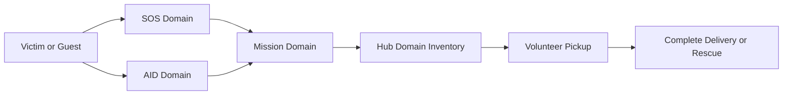
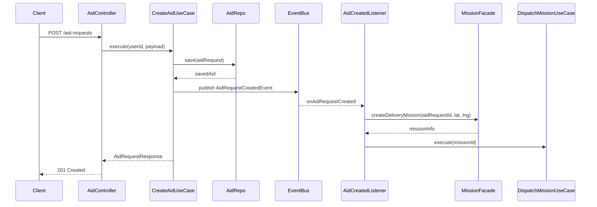
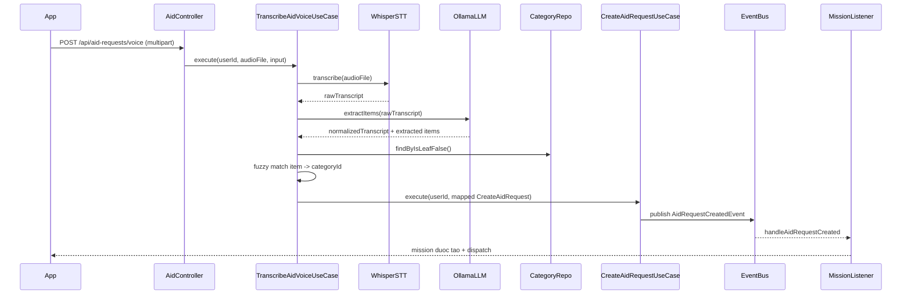
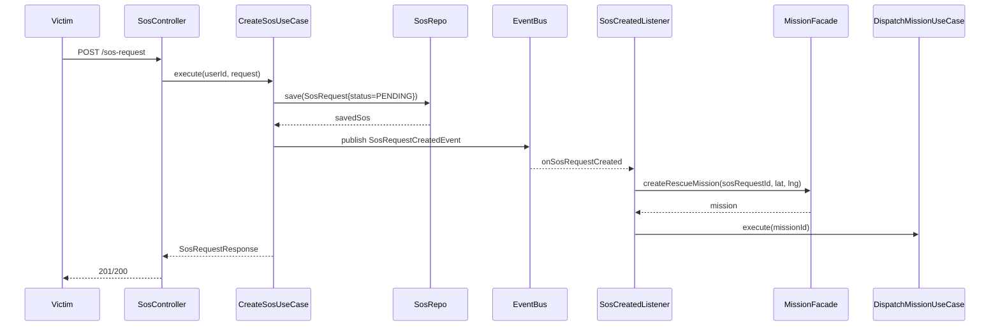
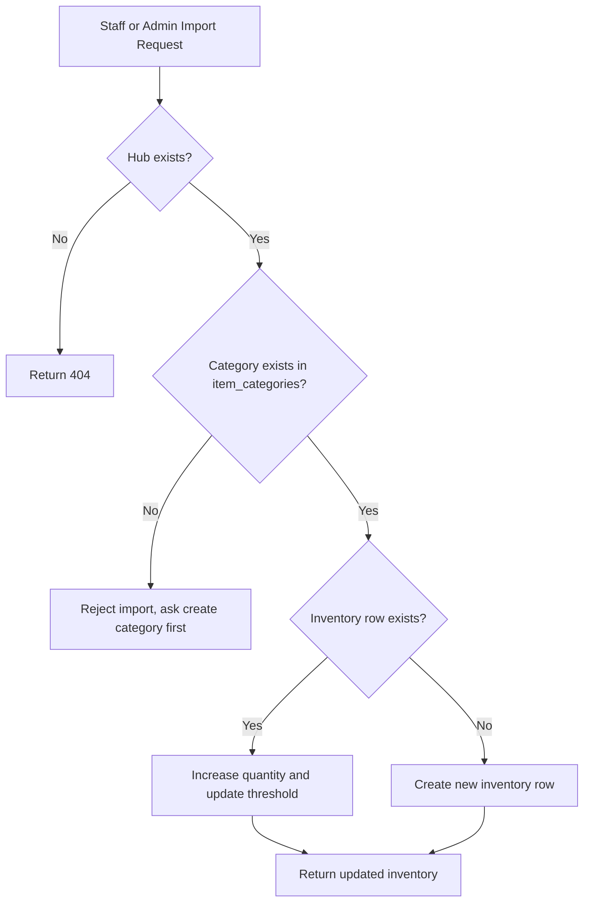

# AidBridge Domain Presentation README

Tai lieu nay tong hop de ban thuyet trinh theo 2 muc tieu:
- Bao cao tien do thuc hien (domain AID, SOS, HUB)
- Bao cao ky thuat (kien truc he thong, flow xu ly, pseudocode)

## 1. Kien truc he thong tong the

### 1.1 Kien truc logic
- Monorepo gom:
  - `drc-app/` (Android, Java 17, MVVM + Clean Architecture)
  - `spring-backend/` (Java 25, Spring Boot 4, Modular Monolith)
- Backend theo huong:
  - `Controller -> UseCase/Service -> Repository -> DB`
  - Giao tiep lien module qua `Facade` (dong bo) va `Event` (bat dong bo)

### 1.2 Kien truc du lieu va realtime
- PostgreSQL (Supabase) + PostGIS: Source of Truth, truy van khong gian.
- Redis: cache/session/dispatch queue/location hot-data.
- Supabase Realtime + WebSocket/STOMP: cap nhat trang thai mission/chat/live tracking.
- FCM: gui thong bao dispatch, canh bao SOS, cap nhat trang thai.

### 1.3 Luong tong quat lien domain


## 2. Domain AID (Yeu cau tiep te)

### 2.1 Trach nhiem chinh
- Nhan yeu cau nhu yeu pham tu nan nhan.
- Quan ly danh sach item theo category.
- Co flow tao request bang giong noi (AI transcription).
- Publish event de Mission module tao va dispatch nhiem vu giao hang.

### 2.2 API da co
- `POST /aid-requests`: tao aid request
- `GET /aid-requests`: danh sach aid request
- `GET /aid-requests/{id}`: chi tiet aid request
- `POST /aid-requests/{id}/cancel`: huy aid request
- `POST /aid-requests/voice`: tao goi yeu cau bang audio

### 2.3 Dac diem ky thuat quan trong
- Da cap nhat model backend sang PostGIS `Point` (SRID 4326) de luu vi tri.
- DTO van giu `lat/lng` de tuong thich API (mapper Point <-> lat/lng).
- Voice pipeline da hardening encoding tren Windows (UTF fallback + BOM-aware).

### 2.4 Flow xu ly AID (manual input)


### 2.5 Pseudocode minh hoa
```text
function createAidRequest(userId, req):
  validate(req)
  point = Point(req.lat, req.lng, srid=4326)
  aid = AidRequest(
    requesterId=userId,
    location=point,
    counts=(adult, elderly, children),
    urgency=req.urgency,
    status=PENDING
  )
  saved = aidRepository.save(aid)
  saveAidItems(saved.id, req.items)
  eventPublisher.publish(AidRequestCreatedEvent(saved.id, saved.lat, saved.lng))
  return mapper.toResponse(saved, null)

listener onAidRequestCreated(event):
  mission = missionFacade.createDeliveryMission(event.aidRequestId, event.lat, event.lng)
  dispatchMissionUseCase.execute(mission.id)
```

### 2.6 Voice API deep-dive (cach lam va cach trinh bay)

#### Endpoint va contract
- Endpoint: `POST /api/aid-requests/voice`
- Auth: can JWT (`@AuthenticationPrincipal Jwt`)
- Content-Type: `multipart/form-data`
- Multipart parts:
  - `file`: audio upload (bat buoc)
  - Form fields: `lat`, `lng`, `address`, `adultsCount`, `elderlyCount`, `childrenCount`, `notes`, `urgencyLevel`

Luu y implementation hien tai:
- Controller nhan `@RequestPart("file")` va `@ModelAttribute CreateAidRequestVoiceInput`.
- `lat/lng` la bat buoc, people count >= 0.

#### Luong xu ly backend (thuc te trong code)


#### Pseudocode tong quat
```text
function transcribeVoiceAid(userId, audioFile, input):
  require audioFile not empty

  transcript = speechToTextService.transcribe(audioFile)
  extraction = voiceLlmService.extractItems(transcript)

  categories = aidItemCategoryRepo.findByIsLeafFalse()
  matchedCategoryIds = unique()
  for item in extraction.items:
    best = findBestCategoryByNormalizeAndContains(item.name, categories)
    if best != null:
      matchedCategoryIds.add(best.id)

  if matchedCategoryIds is empty:
    throw BadRequest("No extracted items matched inventory categories")

  createReq = {
    lat: input.lat,
    lng: input.lng,
    address: input.address,
    adultsCount: input.adultsCount != 0 ? input.adultsCount : 1,
    elderlyCount: input.elderlyCount,
    childrenCount: input.childrenCount,
    notes: merge(input.notes, extraction.normalizedTranscript),
    urgencyLevel: input.urgencyLevel,
    items: matchedCategoryIds -> AidItemInput(itemCategoryId)
  }

  return createAidRequestUseCase.execute(userId, createReq)
```

#### Cong nghe va dependency runtime
- STT local: Python Whisper CLI (`python -m whisper ... --output_format txt`).
- LLM local: Ollama CLI (`ollama run llama3`) de chuan hoa transcript va rut trich category.
- Match danh muc: normalize bo dau + lowercase + contains matching.

#### Hardening dang co
- Co timeout cho Whisper va Ollama de tranh treo tien trinh.
- Co sanitize output tu LLM (xu ly ky tu dieu khien, fenced json, parse fallback).
- Co fallback notes: noi `notes` cua user voi normalized transcript.

#### Cac tinh huong loi can trinh bay
- Audio rong/khong upload: reject ngay tai use case.
- STT fail hoac timeout: throw runtime exception, tra loi loi nghiep vu.
- LLM khong tra JSON hop le: fail parsing va tra loi.
- Khong match duoc category: reject voi message ro rang.

#### Muc tieu demo Voice API (1 phut)
1. Gui file audio + lat/lng.
2. Show transcript duoc tao.
3. Show category duoc map thanh `itemCategoryId`.
4. Show aid request tao thanh cong.
5. Show mission duoc tao/dispatched qua event listener.

#### Vi du request de demo
```bash
curl -X POST http://localhost:8080/api/aid-requests/voice \
  -H "Authorization: Bearer <access_token>" \
  -F "file=@sample.m4a" \
  -F "lat=10.7769" \
  -F "lng=106.7009" \
  -F "address=123 Nguyen Hue, Quan 1" \
  -F "adultsCount=2" \
  -F "elderlyCount=1" \
  -F "childrenCount=0" \
  -F "urgencyLevel=HIGH" \
  -F "notes=Can ho tro gap"
```

## 3. Domain SOS (Cuu ho khan cap)

### 3.1 Trach nhiem chinh
- Tiep nhan SOS khan cap.
- Gan muc do khan cap va trang thai ban dau `PENDING`.
- Publish event de Mission module tao va dispatch mission cuu ho.

### 3.2 API/Use case chinh
- `POST /sos-request`: tao SOS cho user da xac thuc.
- `GET /api/victim/sos-requests/{id}`: xem chi tiet SOS + mission.
- `GET /api/victim/sos-requests`: liet ke SOS + mission.
- UseCase: `CreateSosRequestUseCase`, `GetSosRequestUseCase`, `ListSosRequestsUseCase`.

### 3.3 Flow xu ly SOS


### 3.4 Pseudocode minh hoa
```text
function createSosRequest(userId, req):
  requester = userFacade.getUserById(userId)
  sos = SosRequest.from(req)
  sos.requesterId = requester.id
  sos.status = PENDING
  saved = sosRepository.save(sos)
  eventPublisher.publish(SosRequestCreatedEvent(saved.id, saved.lat, saved.lng))
  return sosMapper.toResponse(saved, null)

listener onSosRequestCreated(event):
  mission = missionFacade.createRescueMission(event.sosRequestId, event.lat, event.lng)
  dispatchMissionUseCase.execute(mission.id)
```

## 4. Domain HUB (Tram trung chuyen + kho)

### 4.1 Trach nhiem chinh
- Quan ly thong tin tram (Hub metadata).
- Quan ly ton kho theo category (`hub_inventories`).
- Nhap kho boi Staff/Admin.

### 4.2 API da co
- `GET /api/hubs`
- `GET /api/hubs/{id}`
- `POST /api/hubs` (ADMIN)
- `PATCH /api/hubs/{id}` (ADMIN)
- `POST /api/hubs/{id}/inventory/import` (STAFF, ADMIN)

### 4.3 Flow nhap kho


### 4.4 Pseudocode minh hoa
```text
function importHubInventory(hubId, elements, actorRole):
  require actorRole in [STAFF, ADMIN]
  hub = hubRepo.findById(hubId) or throw NotFound
  for e in elements:
    assert e.quantity > 0
    assert categoryRepo.exists(e.itemCategoryId)
    inv = inventoryRepo.findByHubAndCategory(hubId, e.itemCategoryId)
    if inv exists:
      inv.quantity += e.quantity
      if e.lowStockThreshold provided: inv.threshold = e.lowStockThreshold
      inventoryRepo.save(inv)
    else:
      inventoryRepo.save(new Inventory(hubId, e.itemCategoryId, e.quantity, e.lowStockThreshold))
  return inventoryRepo.findAllByHub(hubId)
```

## 5. Bao cao tien do (goi y de trinh bay)

### 5.1 Da hoan thanh
- SOS:
  - Tao/liet ke/xem chi tiet SOS
  - Tich hop tao mission cuu ho
  - Co facade de domain khac tra cuu/trang thai
- AID:
  - CRUD can ban cho aid request + cancel
  - Voice aid request flow
  - Chuyen location sang PostGIS Point de san sang spatial query
- HUB:
  - Tao/cap nhat hub
  - Stock-in cho Staff/Admin
  - Rule category validation trong import

### 5.2 Dang duoc cung co / can chot
- Guest SOS endpoint: use case da co, can public endpoint neu can dung tu app guest.
- Inventory log audit cho luong nhap kho/xuat kho can day du hon de bao cao minh bach.
- Chuan hoa tai lieu API va backend model aid items (kiem tra dong bo schema hien hanh).

## 6. Bao cao ky thuat (diem nhan)

### 6.1 Mo hinh kien truc
- Modular Monolith de de tach module, de test, de mo rong.
- Event-driven listener de giam coupling giua SOS/AID va Mission/Notification.

### 6.2 Geospatial va toi uu
- PostGIS + SRID 4326 cho truy van khoang cach/hub gan nhat.
- Redis cho hot data va dispatch queue.

### 6.3 Dispatch strategy
- SOS: Broadcast cho nhieu volunteer cung luc (uu tien toc do).
- AID: Sequential batches (uu tien toi uu nhan luc va khoang cach).

Cong thuc diem uu tien co the trinh bay:

$$S = (D \times 50\%) + (T \times 25\%) + (A \times 25\%)$$

Trong do:
- $D$: Distance score
- $T$: Task completion score
- $A$: Average response score

## 7. De cuong slide de xai ngay (10-12 slides)
1. Bai toan va muc tieu he thong
2. Kien truc tong the (mobile + backend + data stores)
3. Domain map: SOS - AID - Mission - Hub
4. SOS domain: flow + use case
5. AID domain: flow manual + voice
6. Hub domain: flow stock-in
7. Dispatch strategy (broadcast vs sequential)
8. Geospatial/PostGIS + Redis realtime
9. Tien do da xong theo module
10. Van de ton dong + ke hoach sprint tiep theo
11. Demo scenario end-to-end
12. KPI du kien (thoi gian gan volunteer, ty le assign thanh cong, SLA)

## 8. Demo script ngan (3-5 phut)
- Buoc 1: Tao SOS request -> show mission duoc tao.
- Buoc 2: Tao Aid request -> show mission delivery.
- Buoc 3: Staff import kho hub -> show inventory thay doi.
- Buoc 4: Volunteer nhan task -> update status realtime.
- Buoc 5: Hoan tat nhiem vu -> trang thai request/missions ket thuc.

## 9. Q&A ky thuat de phong van
- Tai sao dung Modular Monolith thay vi microservices ngay tu dau?
- Lam sao dam bao khong oversell inventory khi nhieu request den dong thoi?
- Event-driven co dam bao exactly-once khong? Co can outbox pattern khong?
- Cach fallback khi voice transcription loi/encoding loi?
- Cach giu can bang giua toc do dispatch va do chinh xac matching?

---

Neu can, co the tach tai lieu nay thanh 2 ban:
- Ban cho stakeholder (it ky thuat, nhieu KPI)
- Ban cho technical review (nhieu flow, pseudocode, trade-off)
