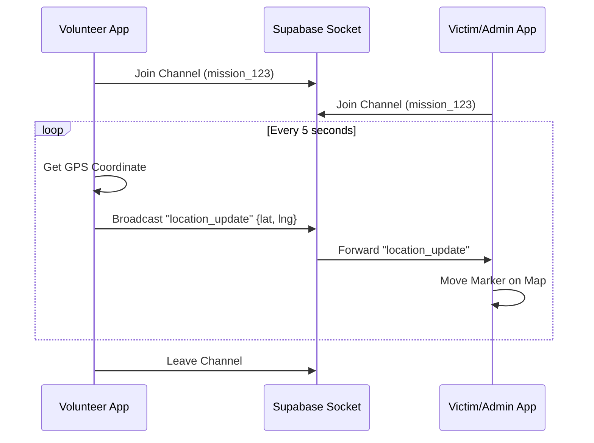

# Chiến lược Thực hiện Live Tracking với Supabase Realtime

Tài liệu này mô tả chi tiết chiến lược triển khai tính năng theo dõi vị trí trực tiếp (Live Tracking) cho ứng dụng AidBridge sử dụng Supabase Realtime (WebSockets).

## 1. Phân tích Khả thi (Feasibility Study)

### 1.1. Khả năng tương thích với Android Java
*   **Thư viện sử dụng:** `supabase-kt` (phiên bản Kotlin Multiplatform). Đây là bộ SDK phổ biến và mạnh mẽ nhất hiện nay để làm việc với Supabase trên Android.
*   **Java Interoperability:** Mặc dù dự án Frontend Android (`drc-app`) hiện tại sử dụng Java 17, Kotlin hoàn toàn có thể tương thích ngược (interop) với Java. 
*   **Giải pháp:** Sử dụng một lớp "Bridge" hoặc "Helper" viết bằng Kotlin. Lớp này sẽ xử lý các Coroutines và Flow của Kotlin, sau đó cung cấp các interface (callback) đơn giản cho code Java gọi vào.
*   **Phiên bản Android:** Với `minSdk 29`, ứng dụng hoàn toàn hỗ trợ tốt các giao thức WebSocket và các thư viện mạng hiện đại như Ktor (được Supabase sử dụng).

### 1.2. Tại sao chọn Supabase Realtime Broadcast?
Chúng ta sẽ sử dụng tính năng **Broadcast** của Supabase thay vì *Postgres Changes*:
*   **Tốc độ:** Broadcast gửi dữ liệu trực tiếp giữa các client thông qua Websocket mà không ghi vào Database. Điều này cực kỳ quan trọng cho tracking vị trí (cập nhật mỗi 3-5 giây) để tránh làm "nghẽn" database.
*   **Chi phí:** Không tốn tài nguyên ghi/đọc DB liên tục.
*   **Latency:** Độ trễ cực thấp (sub-second), phù hợp cho việc di chuyển marker trên bản đồ mượt mà.

---

## 2. Cấu hình Hệ thống (Configuration)

### 2.1. Cấu hình Frontend (Android)
Cần kích hoạt các dependency trong `app/build.gradle` (hiện đang bị comment ở dòng 212-220):

```gradle
dependencies {
    // Supabase & Real-time
    implementation platform("io.github.jan-tennert.supabase:bom:3.5.0")
    implementation "io.github.jan-tennert.supabase:realtime-kt"
    implementation "io.ktor:ktor-client-android:2.3.10"
    implementation "org.jetbrains.kotlinx:kotlinx-coroutines-android:1.8.0"
    implementation "org.jetbrains.kotlinx:kotlinx-serialization-json:1.6.3"
}
```

Và thêm các thông số vào `local.properties` (hoặc `BuildConfig` thông qua Gradle):
```properties
SUPABASE_URL = https://your-project.supabase.co
SUPABASE_ANON_KEY = your-anon-key
```

### 2.2. Các File Skeleton Hiện có
Dự án đã có sẵn khung xương (skeleton) cho tính năng này tại package `com.drc.aidbridge.ui.map.realtime`:
1.  **`SupabaseBroadcastHelper.kt`**: Lớp Helper viết bằng Kotlin để gọi SDK Supabase.
2.  **`VolunteerLocationBroadcaster.java`**: Quản lý việc gửi vị trí từ phía Volunteer.
3.  **`VictimLocationListener.java`**: Quản lý việc nhận vị trí từ phía Nạn nhân/Admin.

*Lưu ý: Hiện tại các file này đang được comment lại để tránh lỗi compile khi chưa cài đặt thư viện.*

---

## 3. Luồng Thực thi (Flow)

### 3.1. Đối với Tình nguyện viên (Broadcaster)
Luồng này dành cho người đang thực hiện nhiệm vụ cứu hộ.

1.  **Khởi tạo:** Khi Volunteer bắt đầu nhiệm vụ, gọi `VolunteerLocationBroadcaster.startBroadcasting()`.
2.  **Kết nối:** `SupabaseBroadcastHelper` kết nối tới kênh có tên: `tracking_mission_{mission_id}`.
3.  **Lấy vị trí:** Sử dụng `FusedLocationProviderClient` để lấy tọa độ GPS định kỳ (ví dụ: mỗi 5 giây).
4.  **Broadcast:** Gửi dữ liệu JSON qua socket:
    ```json
    {
      "event": "location_update",
      "payload": {
        "latitude": 10.1234,
        "longitude": 106.5678,
        "heading": 45.0
      }
    }
    ```
5.  **Dọn dẹp:** Khi xong nhiệm vụ hoặc tắt app, gọi `stopBroadcasting()` để ngắt kết nối và dừng GPS.

### 3.2. Đối với Nạn nhân/Admin (Listener)
Luồng này dành cho người muốn theo dõi vị trí của Volunteer trên bản đồ.

1.  **Khởi tạo:** Khi mở màn hình bản đồ nhiệm vụ, gọi `VictimLocationListener.startListening()`.
2.  **Kết nối:** Kết nối tới cùng kênh `tracking_mission_{mission_id}`.
3.  **Lắng nghe:** Đăng ký sự kiện `location_update`.
4.  **Cập nhật UI:** Khi nhận được payload, callback về Java code để cập nhật vị trí của Marker trên Google Maps/OSM.

---

## 4. Chi tiết Triển khai Code (Java-Kotlin Bridge)

### 4.1. Lớp Helper (Kotlin)
Lớp này sẽ đóng vai trò là "cầu nối". Nó quản lý `SupabaseClient` và `CoroutineScope`.

*   **Chức năng:** `joinChannel`, `broadcastLocation`, `listenForLocationUpdates`.
*   **Interface cho Java:** Định nghĩa `OnLocationReceivedListener` để code Java có thể nhận dữ liệu.

### 4.2. Lớp Broadcaster (Java)
Xử lý logic Android:
*   Kiểm tra quyền truy cập vị trí (Runtime Permissions).
*   Sử dụng `LocationRequest` với `PRIORITY_HIGH_ACCURACY`.
*   Gọi Helper để gửi dữ liệu.

---

## 5. Các vấn đề cần lưu ý

1.  **Quản lý Vòng đời (Lifecycle):** Phải ngắt kết nối socket khi Fragment/Activity bị hủy để tránh rò rỉ bộ nhớ (Memory Leak) và tốn pin.
2.  **Chế độ chạy ngầm (Background Service):** Nếu muốn tracking ngay cả khi tắt màn hình, cần triển khai `Foreground Service` kèm theo Notification.
3.  **Xử lý Mất mạng:** Supabase SDK có cơ chế tự động kết nối lại (auto-reconnect). Cần hiển thị UI thông báo trạng thái kết nối cho người dùng.
4.  **Bảo mật:** Hiện tại sử dụng `anon_key` cho đơn giản. Trong tương lai, có thể sử dụng JWT token do Spring Backend cấp phát để định danh chính xác người gửi là ai.

---

## 6. Sơ đồ Hoạt động (Sequence Diagram)



Tài liệu này sẽ được dùng làm căn cứ để bắt đầu viết code cho module `com.drc.aidbridge.ui.map.realtime`.
