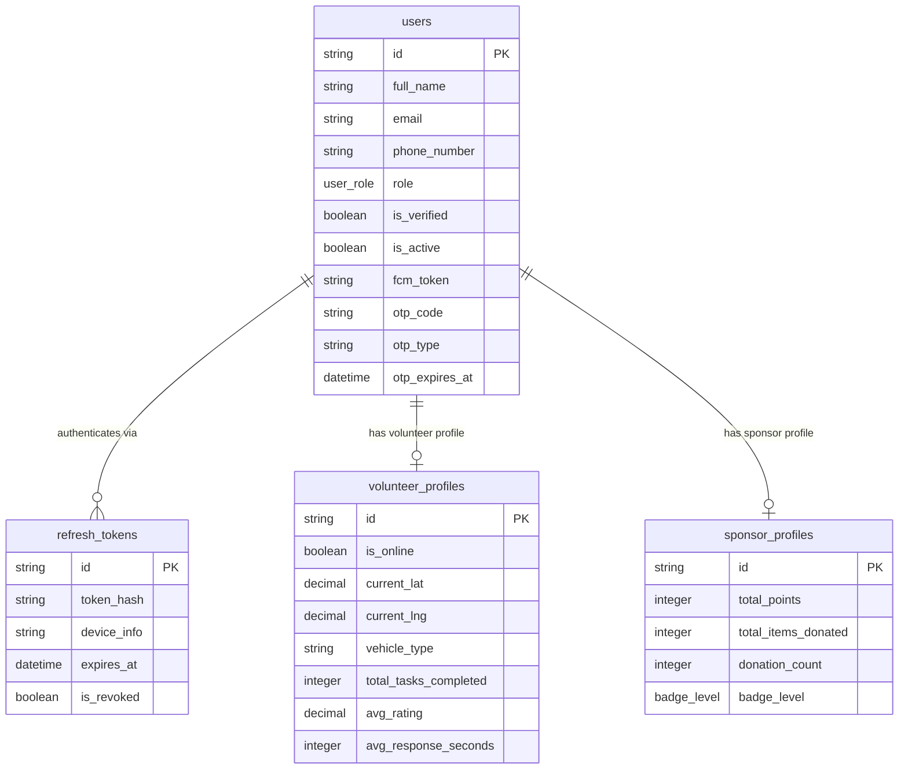
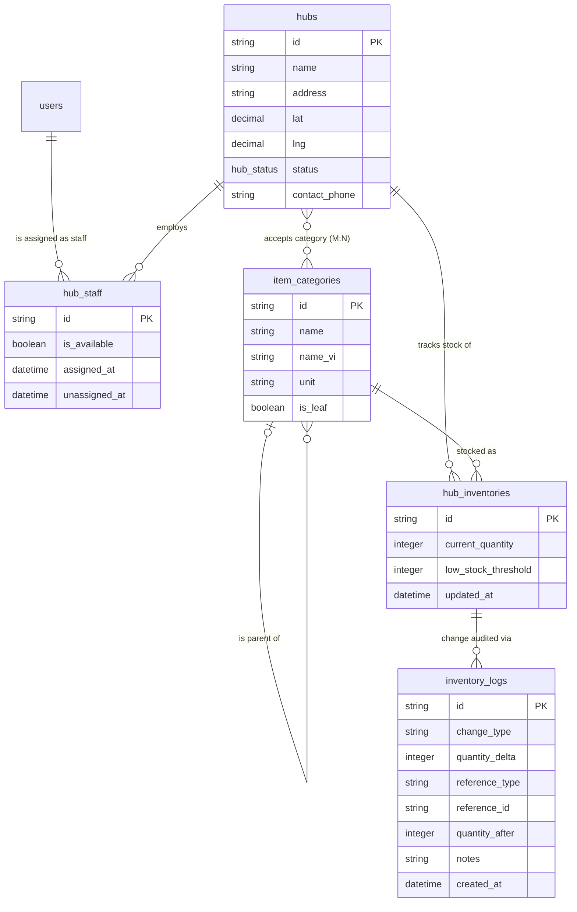
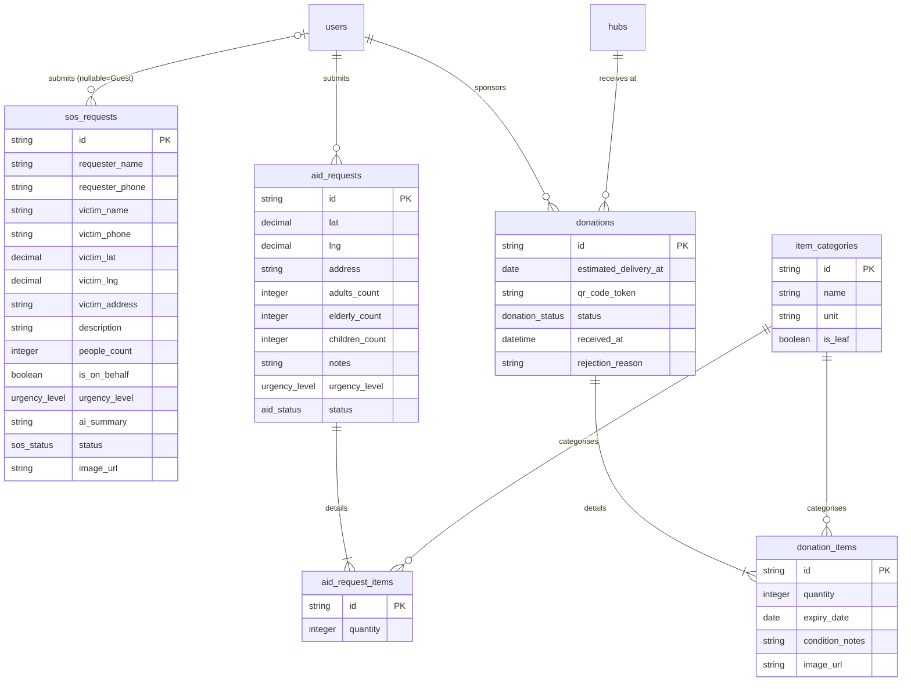
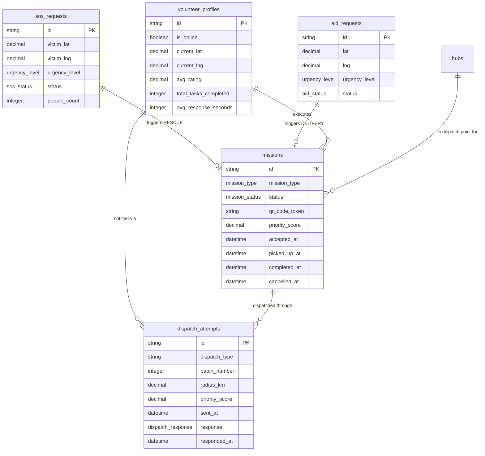
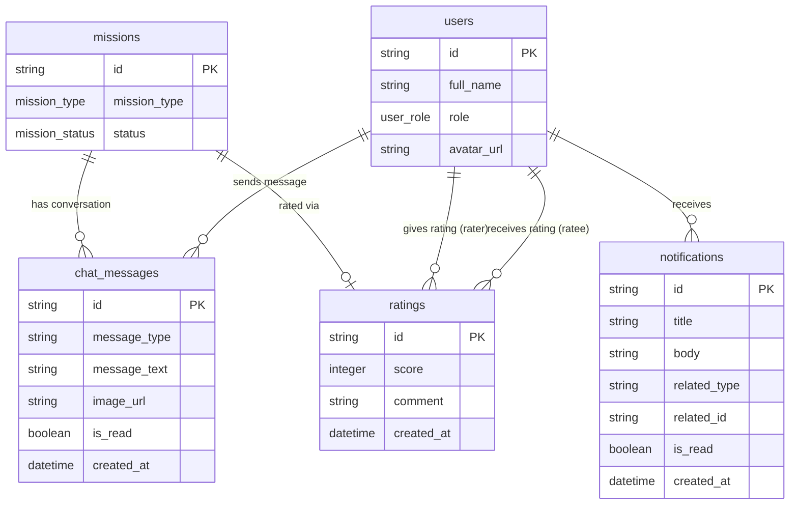

# AidBridge — ERD: Detailed Logical ERD

> **Mục đích:** Bản đồ dữ liệu nghiệp vụ thuần túy — dành cho Business Analyst & Developer hiểu luồng dữ liệu.
> **Nguyên tắc:** KHÔNG có FK columns, KHÔNG có junction table thuần túy, KHÔNG có kiểu dữ liệu vật lý. Cardinality phản ánh đúng thực tế nghiệp vụ.
> **Physical Schema:** Xem [physical_database.md](./physical_database.md)

---

## Sơ đồ tổng thể (Full Logical ERD)

```mermaid
%%{init: {"er": {"layoutDirection": "TB", "diagramPadding": 20}}}%%
erDiagram
    %% ================================================================
    %% NHÓM: AUTH & SESSIONS
    %% ================================================================
    users {}
    refresh_tokens {}

    %% ================================================================
    %% NHÓM: PROFILES (mở rộng theo vai trò)
    %% ================================================================
    volunteer_profiles {}
    sponsor_profiles {}

    %% ================================================================
    %% NHÓM: HẠ TẦNG
    %% ================================================================
    hubs {}
    hub_staff {}
    shelters {}
    system_config {}

    %% ================================================================
    %% NHÓM: DANH MỤC & KHO HÀNG
    %% ================================================================
    item_categories {}
    hub_inventories {}
    inventory_logs {}

    %% ================================================================
    %% NHÓM: YÊU CẦU CỨU TRỢ
    %% ================================================================
    sos_requests {}
    aid_requests {}
    aid_request_items {}

    %% ================================================================
    %% NHÓM: QUYÊN GÓP
    %% ================================================================
    donations {}
    donation_items {}

    %% ================================================================
    %% NHÓM: NHIỆM VỤ
    %% ================================================================
    missions {}
    dispatch_attempts {}

    %% ================================================================
    %% NHÓM: GIAO TIẾP
    %% ================================================================
    chat_messages {}
    ratings {}
    notifications {}

    %% ================================================================
    %% QUAN HỆ: AUTH & PROFILES
    %% ================================================================
    users ||--o{ refresh_tokens          : "authenticates via"
    users ||--o| volunteer_profiles      : "has volunteer profile"
    users ||--o| sponsor_profiles        : "has sponsor profile"

    %% ================================================================
    %% QUAN HỆ: HẠ TẦNG & KHO
    %% ================================================================
    users           ||--o{ hub_staff       : "is assigned as staff"
    hubs            ||--o{ hub_staff       : "employs"
    hubs            }o--o{ item_categories : "accepts category (M:N)"
    hubs            ||--o{ hub_inventories : "tracks stock of"
    item_categories  o|--o{ item_categories : "is parent of"
    item_categories ||--o{ hub_inventories : "stocked as"
    hub_inventories ||--o{ inventory_logs  : "change audited via"

    %% ================================================================
    %% QUAN HỆ: YÊU CẦU CỨU TRỢ
    %% ================================================================
    users           o|--o{ sos_requests      : "submits (nullable for Guest)"
    users           ||--o{ aid_requests      : "submits"
    aid_requests    ||--|{ aid_request_items : "details"
    item_categories ||--o{ aid_request_items : "categorises"

    %% ================================================================
    %% QUAN HỆ: QUYÊN GÓP
    %% ================================================================
    users           ||--o{ donations      : "sponsors"
    hubs            ||--o{ donations      : "receives at"
    users           ||--o{ inventory_logs : "performs action"
    donations       ||--|{ donation_items : "details"
    item_categories ||--o{ donation_items : "categorises"

    %% Inventory log nguồn (polymorphic reference)
    donations ||--o{ inventory_logs : "source of INBOUND log"
    missions  ||--o{ inventory_logs : "source of OUTBOUND log"

    %% ================================================================
    %% QUAN HỆ: NHIỆM VỤ & PHÂN CÔNG
    %% ================================================================
    sos_requests       ||--o| missions          : "triggers RESCUE mission"
    aid_requests       ||--o| missions          : "triggers DELIVERY mission"
    volunteer_profiles ||--o{ missions          : "executes"
    hubs               ||--o{ missions          : "is dispatch point for (DELIVERY)"
    volunteer_profiles ||--o{ dispatch_attempts : "notified via"
    missions           ||--o{ dispatch_attempts : "dispatched through"

    %% ================================================================
    %% QUAN HỆ: GIAO TIẾP
    %% ================================================================
    missions ||--o{ chat_messages : "has conversation"
    users    ||--o{ chat_messages : "sends message"
    missions ||--o|  ratings      : "rated via"
    users    ||--o{ ratings       : "gives rating (rater)"
    users    ||--o{ ratings       : "receives rating (ratee)"
    users    ||--o{ notifications : "receives"
```

---

## Sub-Diagrams theo Domain

### A — Auth & Profiles

---

### B — Infrastructure & Inventory

---

### C — Requests & Donations

---

### D — Missions & Dispatch

---

### E — Communication

---

## Ghi chú về Cardinality

| Ký hiệu Mermaid | Nghĩa |
|-----------------|-------|
| `\|\|--\|\|` | Exactly one — Exactly one (1:1 bắt buộc hai phía) |
| `\|\|--o\|` | Exactly one — Zero or one (bắt buộc một phía, tuỳ chọn phía kia) |
| `\|\|--|{` | Exactly one — One or many (bắt buộc có ít nhất 1) |
| `\|\|--o{` | Exactly one — Zero or many (1:N) |
| `o\|--o{` | Zero or one — Zero or many |
| `}o--o{` | Zero or many — Zero or many **(M:N thuần khái niệm)** |

> **Chú ý M:N:** Quan hệ `hubs }o--o{ item_categories` biểu diễn việc Hub chấp nhận nhiều loại hàng và mỗi loại hàng được nhiều Hub chấp nhận. Trong Physical Schema, quan hệ này được giải quyết bằng Junction Table `hub_accepted_categories`.

---

## ENUM Reference

| ENUM | Giá trị |
|------|---------|
| `user_role` | `VICTIM`, `VOLUNTEER`, `SPONSOR`, `STAFF`, `ADMIN` |
| `hub_status` | `ACTIVE`, `INACTIVE`, `EMERGENCY` |
| `urgency_level` | `CRITICAL`, `HIGH`, `MEDIUM`, `LOW` |
| `sos_status` | `PENDING`, `DISPATCHING`, `ASSIGNED`, `IN_PROGRESS`, `COMPLETED`, `CANCELLED` |
| `aid_status` | `PENDING`, `DISPATCHING`, `ASSIGNED`, `PICKED_UP`, `IN_TRANSIT`, `COMPLETED`, `CANCELLED` |
| `donation_status` | `REGISTERED`, `QR_GENERATED`, `RECEIVED`, `REJECTED` |
| `mission_type` | `RESCUE`, `DELIVERY` |
| `mission_status` | `PENDING`, `DISPATCHING`, `ASSIGNED`, `PICKING_UP`, `PICKED_UP`, `IN_TRANSIT`, `COMPLETED`, `CANCELLED` |
| `dispatch_response` | `PENDING`, `ACCEPTED`, `REJECTED`, `TIMEOUT` |
| `badge_level` | `BRONZE`, `SILVER`, `GOLD`, `PLATINUM` |

---

## Những điểm thiết kế Logic quan trọng

| Thực thể | Ghi chú |
|----------|---------|
| `hub_staff` | **Associative entity** (quan hệ thực thể kết hợp) — giao điểm User–Hub có thuộc tính nghiệp vụ riêng (`is_available`, `assigned_at`, `unassigned_at`) |
| `hub_inventories` | **Associative entity** — giao điểm Hub–ItemCategory có thuộc tính (`current_quantity`, `low_stock_threshold`) |
| `aid_request_items` / `donation_items` | **Associative entities (Line Item pattern)** — giao điểm Request/Donation–ItemCategory có `quantity` |
| `hub_accepted_categories` | **Pure junction (không có thuộc tính riêng)** — biểu diễn là M:N trực tiếp (`}o--o{`) trong Logical ERD |
| `sos_requests.requester_id` | **Nullable** — Guest (không đăng nhập) vẫn được tạo SOS; cardinality phía `users` là `o\|` |
| `ratings` | Có **2 FK ngược chiều** đến `users`: `rater_id` (người đánh giá) và `ratee_id` (người được đánh giá) → Mermaid hiển thị 2 đường nối |
| `inventory_logs.reference_id` | **Polymorphic FK** — trỏ tới `donations` (INBOUND) hoặc `missions` (OUTBOUND); `reference_type` làm discriminator |
| `missions` | **XOR constraint**: loại RESCUE chỉ link `sos_requests`; loại DELIVERY chỉ link `aid_requests` + `hubs` |
