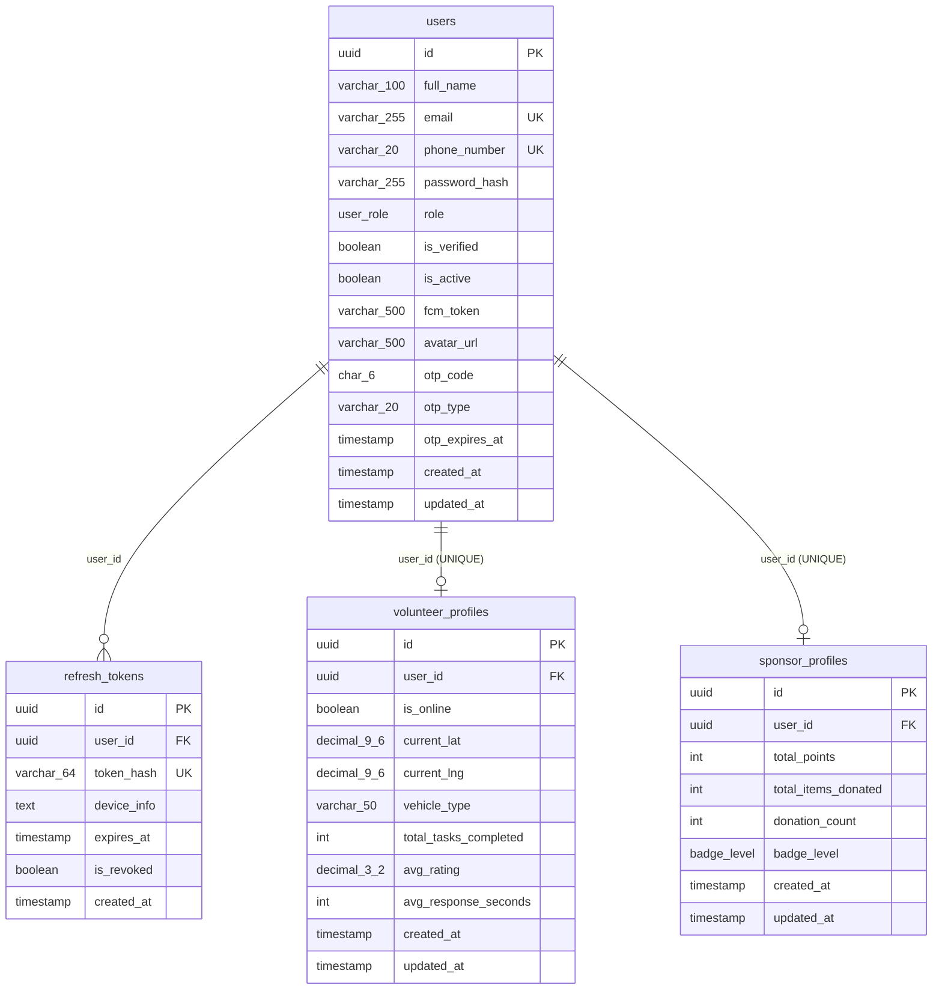
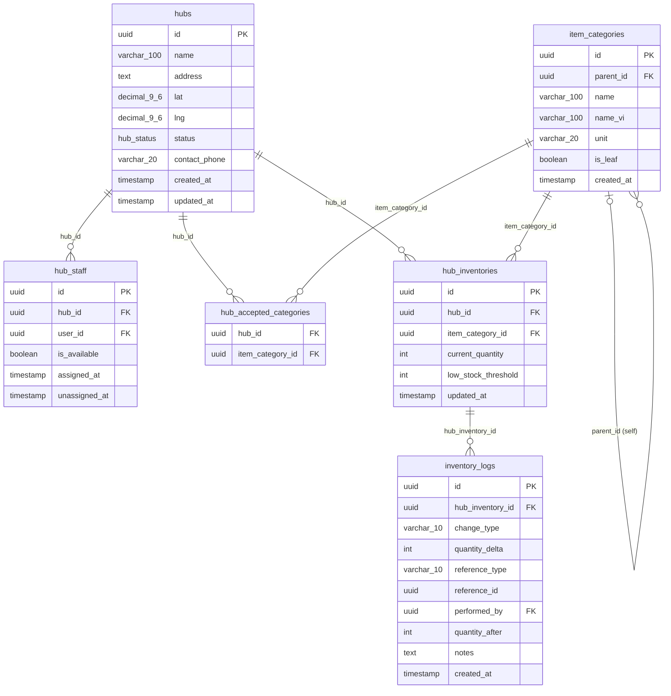
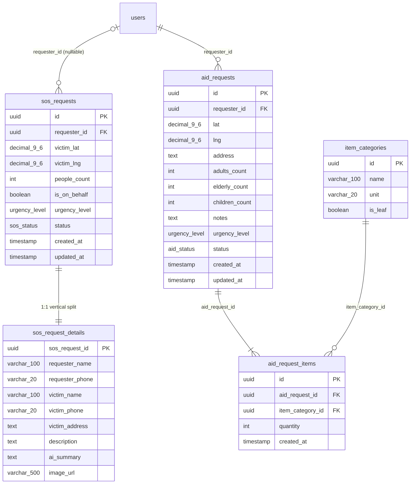
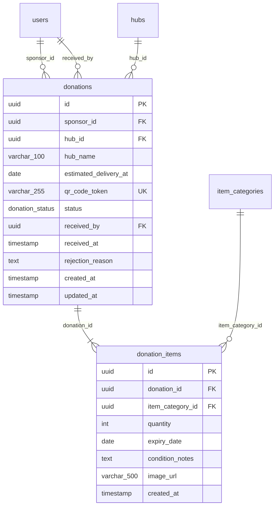
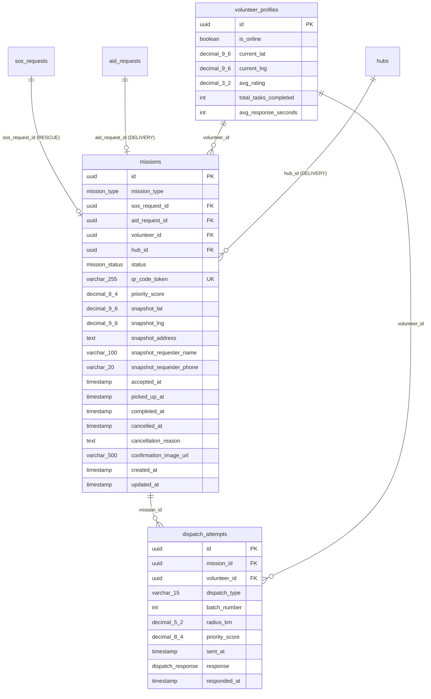
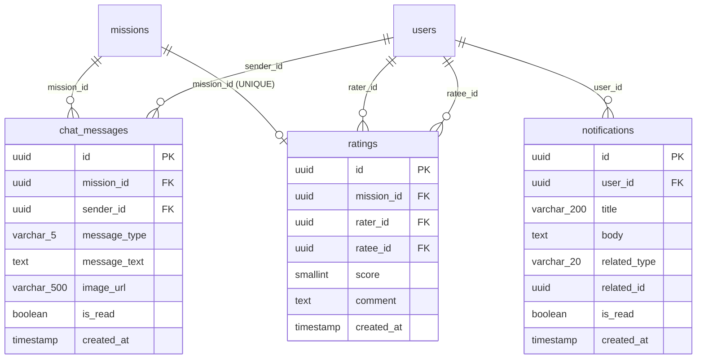

# AidBridge — Physical Database Schema

> **Engine:** PostgreSQL 15+ · **Extension:** `uuid-ossp`
> **23 bảng** · **10 ENUM** · ~38 index
> **Logical ERD:** Xem [erd_v2.md](./erd_v2.md)

---

## Physical Schema Diagram (Full)

> **Quy ước kiểu dữ liệu trong Mermaid** (không dùng ký tự đặc biệt):
> `decimal_9_6` = DECIMAL(9,6) · `varchar_100` = VARCHAR(100) · `varchar_255` = VARCHAR(255) · `varchar_500` = VARCHAR(500)

```mermaid
erDiagram
    %% ================================================================
    %% GROUP: AUTH & SESSIONS
    %% ================================================================

    users {
        uuid           id             PK
        varchar_100    full_name
        varchar_255    email          UK
        varchar_20     phone_number   UK
        varchar_255    password_hash
        user_role      role
        boolean        is_verified
        boolean        is_active
        varchar_500    fcm_token
        varchar_500    avatar_url
        char_6         otp_code
        varchar_20     otp_type
        timestamp      otp_expires_at
        timestamp      created_at
        timestamp      updated_at
    }

    refresh_tokens {
        uuid           id             PK
        uuid           user_id        FK
        varchar_64     token_hash     UK
        text           device_info
        timestamp      expires_at
        boolean        is_revoked
        timestamp      created_at
    }

    %% ================================================================
    %% GROUP: PROFILES
    %% ================================================================

    volunteer_profiles {
        uuid           id                     PK
        uuid           user_id                FK
        boolean        is_online
        decimal_9_6    current_lat
        decimal_9_6    current_lng
        varchar_50     vehicle_type
        int            total_tasks_completed
        decimal_3_2    avg_rating
        int            avg_response_seconds
        timestamp      created_at
        timestamp      updated_at
    }

    sponsor_profiles {
        uuid           id                   PK
        uuid           user_id              FK
        int            total_points
        int            total_items_donated
        int            donation_count
        badge_level    badge_level
        timestamp      created_at
        timestamp      updated_at
    }

    %% ================================================================
    %% GROUP: INFRASTRUCTURE
    %% ================================================================

    hubs {
        uuid           id             PK
        varchar_100    name
        text           address
        decimal_9_6    lat
        decimal_9_6    lng
        hub_status     status
        varchar_20     contact_phone
        timestamp      created_at
        timestamp      updated_at
    }

    hub_staff {
        uuid           id             PK
        uuid           hub_id         FK
        uuid           user_id        FK
        boolean        is_available
        timestamp      assigned_at
        timestamp      unassigned_at
    }

    shelters {
        uuid           id               PK
        varchar_100    name
        text           address
        decimal_9_6    lat
        decimal_9_6    lng
        int            current_capacity
        int            max_capacity
        boolean        has_electricity
        boolean        has_clean_water
        varchar_15     status
        timestamp      created_at
        timestamp      updated_at
    }

    system_config {
        varchar_100    key            PK
        text           value
        text           description
        timestamp      updated_at
    }

    %% ================================================================
    %% GROUP: CATALOG & INVENTORY
    %% ================================================================

    item_categories {
        uuid           id           PK
        uuid           parent_id    FK
        varchar_100    name
        varchar_100    name_vi
        varchar_20     unit
        boolean        is_leaf
        timestamp      created_at
    }

    hub_accepted_categories {
        uuid           hub_id              FK
        uuid           item_category_id    FK
    }

    hub_inventories {
        uuid           id                   PK
        uuid           hub_id               FK
        uuid           item_category_id     FK
        int            current_quantity
        int            low_stock_threshold
        timestamp      updated_at
    }

    inventory_logs {
        uuid           id                  PK
        uuid           hub_inventory_id    FK
        varchar_10     change_type
        int            quantity_delta
        varchar_10     reference_type
        uuid           reference_id
        uuid           performed_by        FK
        int            quantity_after
        text           notes
        timestamp      created_at
    }

    %% ================================================================
    %% GROUP: REQUESTS
    %% sos_requests — HOT TABLE (tách ra từ thiết kế gốc)
    %% Chỉ giữ các cột truy vấn nóng: dispatch, heatmap, status check
    %% ================================================================

    sos_requests {
        uuid           id               PK
        uuid           requester_id     FK
        decimal_9_6    victim_lat
        decimal_9_6    victim_lng
        int            people_count
        boolean        is_on_behalf
        urgency_level  urgency_level
        sos_status     status
        timestamp      created_at
        timestamp      updated_at
    }

    %% sos_request_details — COLD TABLE (tách ra từ sos_requests)
    %% Lưu text lớn ít dùng trong dispatch; tải khi cần hiển thị chi tiết
    sos_request_details {
        uuid           sos_request_id    PK
        varchar_100    requester_name
        varchar_20     requester_phone
        varchar_100    victim_name
        varchar_20     victim_phone
        text           victim_address
        text           description
        text           ai_summary
        varchar_500    image_url
    }

    aid_requests {
        uuid           id               PK
        uuid           requester_id     FK
        decimal_9_6    lat
        decimal_9_6    lng
        text           address
        int            adults_count
        int            elderly_count
        int            children_count
        text           notes
        urgency_level  urgency_level
        aid_status     status
        timestamp      created_at
        timestamp      updated_at
    }

    aid_request_items {
        uuid           id                  PK
        uuid           aid_request_id      FK
        uuid           item_category_id    FK
        int            quantity
        timestamp      created_at
    }

    %% ================================================================
    %% GROUP: DONATIONS
    %% ================================================================

    donations {
        uuid              id                      PK
        uuid              sponsor_id              FK
        uuid              hub_id                  FK
        varchar_100       hub_name
        date              estimated_delivery_at
        varchar_255       qr_code_token           UK
        donation_status   status
        uuid              received_by             FK
        timestamp         received_at
        text              rejection_reason
        timestamp         created_at
        timestamp         updated_at
    }

    donation_items {
        uuid           id                  PK
        uuid           donation_id         FK
        uuid           item_category_id    FK
        int            quantity
        date           expiry_date
        text           condition_notes
        varchar_500    image_url
        timestamp      created_at
    }

    %% ================================================================
    %% GROUP: MISSIONS
    %% Denorm: snapshot_* columns — tránh JOIN sang sos/aid tables
    %% khi màn hình Live Tracking và Mission Screen cần dữ liệu liên tục
    %% ================================================================

    missions {
        uuid              id                          PK
        mission_type      mission_type
        uuid              sos_request_id              FK
        uuid              aid_request_id              FK
        uuid              volunteer_id                FK
        uuid              hub_id                      FK
        mission_status    status
        varchar_255       qr_code_token               UK
        decimal_8_4       priority_score
        decimal_9_6       snapshot_lat
        decimal_9_6       snapshot_lng
        text              snapshot_address
        varchar_100       snapshot_requester_name
        varchar_20        snapshot_requester_phone
        timestamp         accepted_at
        timestamp         picked_up_at
        timestamp         completed_at
        timestamp         cancelled_at
        text              cancellation_reason
        varchar_500       confirmation_image_url
        timestamp         created_at
        timestamp         updated_at
    }

    dispatch_attempts {
        uuid               id               PK
        uuid               mission_id       FK
        uuid               volunteer_id     FK
        varchar_15         dispatch_type
        int                batch_number
        decimal_5_2        radius_km
        decimal_8_4        priority_score
        timestamp          sent_at
        dispatch_response  response
        timestamp          responded_at
    }

    %% ================================================================
    %% GROUP: COMMUNICATION
    %% ================================================================

    chat_messages {
        uuid           id              PK
        uuid           mission_id      FK
        uuid           sender_id       FK
        varchar_5      message_type
        text           message_text
        varchar_500    image_url
        boolean        is_read
        timestamp      created_at
    }

    ratings {
        uuid           id              PK
        uuid           mission_id      FK
        uuid           rater_id        FK
        uuid           ratee_id        FK
        smallint       score
        text           comment
        timestamp      created_at
    }

    notifications {
        uuid           id              PK
        uuid           user_id         FK
        varchar_200    title
        text           body
        varchar_20     related_type
        uuid           related_id
        boolean        is_read
        timestamp      created_at
    }

    %% ================================================================
    %% FOREIGN KEY RELATIONSHIPS
    %% ================================================================

    %% --- AUTH ---
    users              ||--o{ refresh_tokens         : "user_id"
    users              ||--o| volunteer_profiles      : "user_id (UNIQUE)"
    users              ||--o| sponsor_profiles        : "user_id (UNIQUE)"

    %% --- INFRASTRUCTURE ---
    users              ||--o{ hub_staff               : "user_id"
    hubs               ||--o{ hub_staff               : "hub_id"

    %% Junction Table hub_accepted_categories (giải quyết M:N)
    hubs               ||--o{ hub_accepted_categories  : "hub_id"
    item_categories    ||--o{ hub_accepted_categories  : "item_category_id"

    hubs               ||--o{ hub_inventories          : "hub_id"
    item_categories    ||--o{ hub_inventories          : "item_category_id"
    item_categories    o|--o{ item_categories          : "parent_id (self-ref)"
    hub_inventories    ||--o{ inventory_logs           : "hub_inventory_id"
    users              ||--o{ inventory_logs           : "performed_by"

    %% --- REQUESTS ---
    users              o|--o{ sos_requests             : "requester_id (nullable)"
    sos_requests       ||--|| sos_request_details      : "sos_request_id (1:1)"
    users              ||--o{ aid_requests             : "requester_id"
    aid_requests       ||--|{ aid_request_items        : "aid_request_id"
    item_categories    ||--o{ aid_request_items        : "item_category_id"

    %% --- DONATIONS ---
    users              ||--o{ donations                : "sponsor_id"
    hubs               ||--o{ donations                : "hub_id"
    users              ||--o{ donations                : "received_by (nullable)"
    donations          ||--|{ donation_items           : "donation_id"
    item_categories    ||--o{ donation_items           : "item_category_id"

    %% --- MISSIONS ---
    sos_requests       ||--o| missions                 : "sos_request_id (RESCUE)"
    aid_requests       ||--o| missions                 : "aid_request_id (DELIVERY)"
    volunteer_profiles ||--o{ missions                 : "volunteer_id"
    hubs               ||--o{ missions                 : "hub_id (DELIVERY)"
    missions           ||--o{ dispatch_attempts        : "mission_id"
    volunteer_profiles ||--o{ dispatch_attempts        : "volunteer_id"

    %% --- COMMUNICATION ---
    missions           ||--o{ chat_messages            : "mission_id"
    users              ||--o{ chat_messages            : "sender_id"
    missions           ||--o| ratings                  : "mission_id (UNIQUE)"
    users              ||--o{ ratings                  : "rater_id"
    users              ||--o{ ratings                  : "ratee_id"
    users              ||--o{ notifications            : "user_id"
```



---

## Domain Sub-Diagrams

### A — Auth & Profiles (Physical)



---

### B — Infrastructure & Inventory (Physical)



---

### C — Requests (Physical + Table Split)



---

### D — Donations (Physical)



---

### E — Missions & Dispatch (Physical + Denorm)



---

### F — Communication (Physical)



---

## Quyết định thiết kế (Design Decisions)

### D1 — Tách bảng `sos_requests` → `sos_requests` + `sos_request_details`

**Vấn đề:** Bảng `sos_requests` gốc chứa hỗn hợp:
- **Cột HOT** (truy vấn rất thường xuyên): `victim_lat`, `victim_lng`, `urgency_level`, `status`, `people_count` — dùng trong **dispatch algorithm** (§7.2), **heatmap query** (§3.2), và status polling từ Victim app.
- **Cột COLD** (TEXT lớn, ít truy vấn): `description`, `ai_summary`, `victim_address`, `requester_name`, `victim_name`, `image_url` — chỉ cần khi Volunteer/Admin xem chi tiết 1 request cụ thể.

**Giải pháp:** Vertical Partitioning 1:1.
- `sos_requests` (hot): chỉ giữ 10 cột nhỏ → mỗi page của buffer pool chứa nhiều row hơn → dispatch query và heatmap query quét ít I/O hơn đáng kể.
- `sos_request_details` (cold): JOIN chỉ khi cần hiển thị chi tiết (mobile detail screen, Admin dashboard).

**Luồng liên quan:** §3.2 (Public Map Heatmap), §7.2 (Dispatch - Bước 2 quét TNV online), §4.6 (Victim History).

---

### D2 — Denorm snapshot columns trong `missions`

**Vấn đề:** Màn hình Live Tracking (§4.4, §5.4) và Mission Screen (§5.3) cần **liên tục** cập nhật vị trí đích và thông tin liên lạc nạn nhân. Mỗi lần cập nhật GPS Volunteer (3-5 giây/lần) → backend tính ETA → cần biết `destination_lat/lng` → phải JOIN `missions` → `sos_requests` HOẶC `missions` → `aid_requests`.

**Giải pháp:** Snapshot 5 cột vào `missions` tại thời điểm Volunteer accept (`accepted_at`):
- `snapshot_lat`, `snapshot_lng`: tọa độ đích (victim location).
- `snapshot_address`: địa chỉ hiển thị trên navigation screen.
- `snapshot_requester_name`, `snapshot_requester_phone`: thông tin liên lạc hiển thị và gọi điện.

**Trade-off:** Dữ liệu dư thừa ~100 bytes/mission. Chấp nhận được vì data tại thời điểm accept là bất biến (victim không thể thay đổi location sau khi mission ASSIGNED).

**Luồng liên quan:** §4.4 (Victim Live Tracking), §5.3 (Volunteer Mission Screen), §5.4 (Volunteer Navigation).

---

### D3 — Junction Table `hub_accepted_categories` (giải quyết M:N)

**Vấn đề:** Trong Logical ERD, `hubs }o--o{ item_categories` là quan hệ M:N thuần khái niệm:
- Một Hub có thể chấp nhận nhiều loại hàng.
- Một loại hàng có thể được nhiều Hub chấp nhận.

**Giải pháp:** Tạo Junction Table `hub_accepted_categories` với Composite PK `(hub_id, item_category_id)`.

**Luồng liên quan:** §6.2 (Smart Hub Selection) — đây là bảng được JOIN trong query tìm Top 3 Hub phù hợp cho Sponsor:
```sql
SELECT h.id, ST_Distance(h.lat, h.lng, $sponsor_lat, $sponsor_lng)
FROM hubs h
JOIN hub_accepted_categories hac ON hac.hub_id = h.id
WHERE h.status = 'ACTIVE'
  AND hac.item_category_id IN ($requested_categories)
ORDER BY dist LIMIT 3;
```

---

### D4 — Denorm `hub_name` trong `donations`

**Vấn đề:** Màn hình QR Code (§6.3) cần hiển thị tên và địa chỉ Hub cho Sponsor. Trong vòng đời donation (`REGISTERED → QR_GENERATED → RECEIVED/REJECTED`), Sponsor xem lại QR nhiều lần từ Lịch sử (§6.5). Mỗi lần load màn hình QR → JOIN `donations → hubs`.

**Giải pháp:** Lưu snapshot `hub_name VARCHAR(100)` vào `donations` tại thời điểm Sponsor chọn Hub (QR_GENERATED).

**Trade-off:** Nếu Hub đổi tên sau khi donation tạo ra, `hub_name` trong donation sẽ cũ. Chấp nhận được vì đây là snapshot lịch sử ("bạn đã chọn trạm X tại thời điểm đó").

**Luồng liên quan:** §6.2 (Hub Selection), §6.3 (QR Screen), §6.5 (Donation History).

---

### D5 — Denorm aggregate columns trong `volunteer_profiles` & `sponsor_profiles`

**Vấn đề:** Priority Score Dispatch (§7.1) cần `avg_rating`, `total_tasks_completed`, `avg_response_seconds` **mỗi lần tính toán** cho tất cả volunteers trong bán kính. Tính lại từ bảng `ratings` và `missions` mỗi lần dispatch = O(n) per volunteer = không chấp nhận được trong real-time dispatch.

**Giải pháp:** Giữ nguyên các cột aggregate đã có trong profiles:
- `volunteer_profiles.avg_rating` — cập nhật atomic khi INSERT `ratings`.
- `volunteer_profiles.total_tasks_completed`, `avg_response_seconds` — cập nhật khi mission → COMPLETED.
- `sponsor_profiles.donation_count`, `total_items_donated`, `total_points` — cập nhật khi donation → RECEIVED.

**Cơ chế cập nhật:** Atomic transaction cùng lúc với INSERT/UPDATE triggering event. Không dùng periodic job (có thể lag).

**Luồng liên quan:** §7.1 (Priority Score), §6.5 (Sponsor Gamification), §5.6 (Volunteer Stats Dashboard).

---

### D6 — Denorm `quantity_after` trong `inventory_logs`

**Vấn đề:** Để biết tồn kho tại bất kỳ thời điểm T trong quá khứ (Admin analytics §9.5), cách tiếp cận thông thường là replay toàn bộ logs từ đầu đến T = O(n). Không khả thi khi logs lớn.

**Giải pháp:** Lưu snapshot `quantity_after INT` — số lượng tồn kho **sau** khi transaction xảy ra. Query tồn kho tại thời điểm T = lấy row cuối cùng trước T = O(1) với index.

**Trade-off:** `inventory_logs` là append-only → không có risk inconsistency. Giá trị này chỉ được ghi 1 lần tại INSERT, không bao giờ UPDATE.

---

### D7 — Polymorphic reference trong `inventory_logs` & `notifications`

**Vấn đề:** `inventory_logs.reference_id` có thể trỏ tới `donations.id` (INBOUND log) hoặc `missions.id` (OUTBOUND log). Tương tự, `notifications.related_id` trỏ tới 4 loại entity khác nhau.

**Giải pháp:** Sử dụng **Polymorphic Pattern**:
- Cặp `(reference_type, reference_id)` / `(related_type, related_id)` — type column làm discriminator
- Không có DB-level FK constraint (PostgreSQL không hỗ trợ polymorphic FK)
- Index `(reference_type, reference_id)` để lookup nhanh

**Hạn chế:** Không có referential integrity ở DB level — application phải validate trước khi INSERT. Chấp nhận vì pattern này phổ biến và cần thiết cho polymorphic audit trail.

---

## Key Constraints Summary

| Bảng | Constraint |
|------|-----------|
| `users` | `CHECK (email IS NOT NULL OR phone_number IS NOT NULL)` |
| `volunteer_profiles` | `UNIQUE (user_id)` |
| `sponsor_profiles` | `UNIQUE (user_id)` |
| `hub_staff` | Partial UNIQUE: `(hub_id, user_id) WHERE unassigned_at IS NULL` |
| `hub_staff` | CHECK: user có `role = 'STAFF'` |
| `hub_accepted_categories` | Composite PK: `(hub_id, item_category_id)` |
| `hub_inventories` | `UNIQUE (hub_id, item_category_id)` · `CHECK (current_quantity >= 0)` |
| `inventory_logs` | `CHECK (quantity_delta > 0)` |
| `sos_request_details` | PK = FK → `sos_requests.id` (1:1 mandatory) |
| `sos_requests` | `CHECK (people_count > 0)` |
| `aid_requests` | `CHECK (adults_count + elderly_count + children_count > 0)` |
| `aid_request_items` | `CHECK (quantity > 0)` |
| `donations` | `UNIQUE (qr_code_token)` |
| `donation_items` | `CHECK (quantity > 0)` |
| `missions` | CHECK RESCUE: `sos_request_id NOT NULL, aid_request_id NULL, hub_id NULL` |
| `missions` | CHECK DELIVERY: `aid_request_id NOT NULL, sos_request_id NULL, hub_id NOT NULL` |
| `missions` | `UNIQUE (qr_code_token)` |
| `ratings` | `UNIQUE (mission_id)` · `CHECK (score BETWEEN 1 AND 5)` |
| `chat_messages` | CHECK: `(TEXT → message_text NOT NULL, image_url NULL)` XOR `(IMAGE → image_url NOT NULL, message_text NULL)` |
| `shelters` | `CHECK (current_capacity <= max_capacity)` |

---

## Index Strategy

```sql
-- DISPATCH (critical hot path)
CREATE INDEX idx_vol_online_loc
    ON volunteer_profiles (current_lat, current_lng)
    WHERE is_online = TRUE;                         -- Partial index: chỉ online volunteers

CREATE INDEX idx_sos_location
    ON sos_requests (victim_lat, victim_lng, status)
    WHERE status IN ('PENDING', 'DISPATCHING');     -- Dispatch + Heatmap

CREATE INDEX idx_aid_location
    ON aid_requests (lat, lng, status)
    WHERE status IN ('PENDING', 'DISPATCHING');

CREATE INDEX idx_hubs_active_loc
    ON hubs (lat, lng)
    WHERE status = 'ACTIVE';                        -- Smart Hub Selection

-- MISSIONS (frequent reads)
CREATE INDEX idx_missions_volunteer_status  ON missions (volunteer_id, status);
CREATE INDEX idx_missions_sos_id            ON missions (sos_request_id) WHERE sos_request_id IS NOT NULL;
CREATE INDEX idx_missions_aid_id            ON missions (aid_request_id) WHERE aid_request_id IS NOT NULL;

-- DISPATCH ATTEMPTS
CREATE INDEX idx_dispatch_pending           ON dispatch_attempts (mission_id)
    WHERE response = 'PENDING';

-- INVENTORY
CREATE INDEX idx_inventory_hub              ON hub_inventories (hub_id);
CREATE INDEX idx_inv_low_stock              ON hub_inventories (hub_id, current_quantity)
    WHERE current_quantity <= low_stock_threshold; -- Staff inventory alerts

CREATE INDEX idx_inv_logs_ref               ON inventory_logs (reference_type, reference_id);

-- DONATIONS
CREATE INDEX idx_donations_sponsor          ON donations (sponsor_id, created_at DESC);
CREATE INDEX idx_donations_hub_status       ON donations (hub_id, status);

-- COMMUNICATION
CREATE INDEX idx_chat_mission_time          ON chat_messages (mission_id, created_at ASC);
CREATE INDEX idx_notif_user_unread          ON notifications (user_id, created_at DESC)
    WHERE is_read = FALSE;
```

---

## Changelog

| Version | Thay đổi |
|---------|---------|
| **v3.1** | Tách bảng `sos_request_details` (vertical split); thêm `snapshot_*` columns vào `missions` (denorm); thêm `hub_name` vào `donations` (denorm); formalize junction table `hub_accepted_categories`; thêm 3 index mới |
| **v3.0** | 22 bảng: bỏ `otp_verifications`, `volunteer_area_experiences`, `attachments`, `safe_paths`; OTP gộp vào `users`; GEOMETRY → lat/lng DECIMAL(9,6); image_url VARCHAR(500) trực tiếp |
| **v2.x** | 26 bảng — thiết kế cũ (deprecated) |
