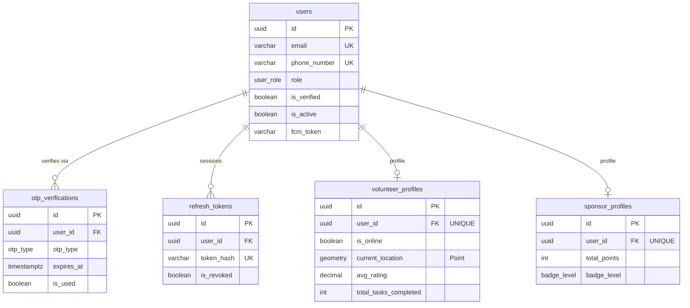
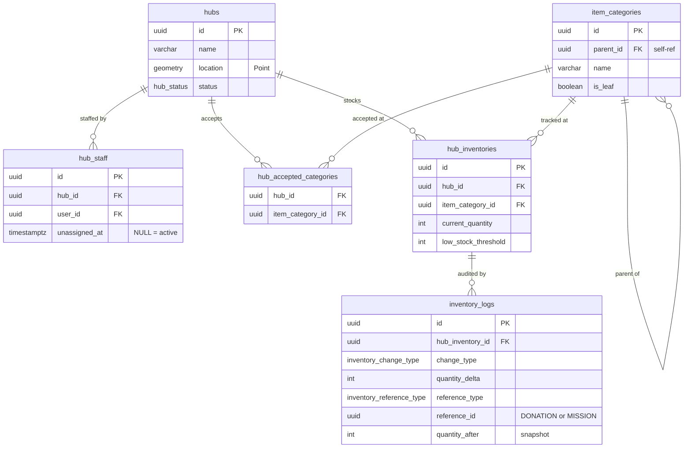
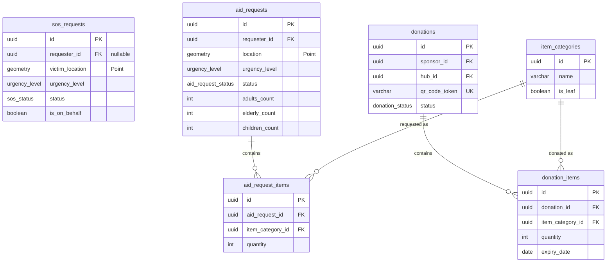
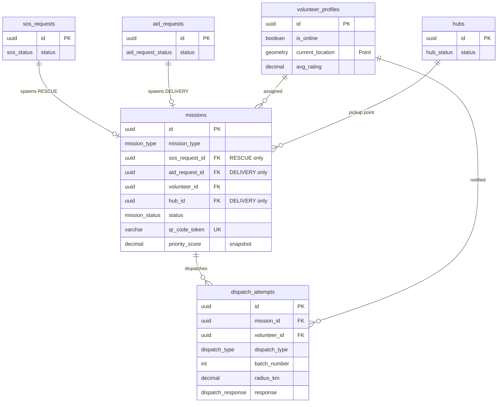
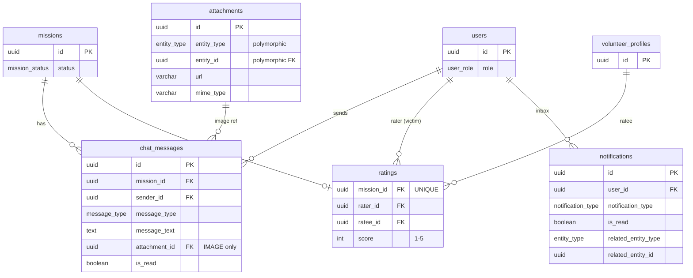

# AidBridge — Entity Relationship Diagram

> Rendered by **Mermaid** (`erDiagram`).  
> Supported in: GitHub, VS Code (Markdown Preview Mermaid Support extension), GitLab, Notion, Obsidian.

---

## Full ERD (All 26 Tables)

```mermaid
erDiagram

    %% ─────────────────────────────────────────
    %% GROUP 1 · USER & AUTH
    %% ─────────────────────────────────────────

    users {
        uuid        id              PK
        varchar     full_name
        varchar     email           UK
        varchar     phone_number    UK
        varchar     password_hash
        user_role   role
        boolean     is_verified
        boolean     is_active
        varchar     fcm_token
        varchar     avatar_url
        timestamptz created_at
        timestamptz updated_at
    }

    otp_verifications {
        uuid        id          PK
        uuid        user_id     FK
        varchar     otp_code
        otp_type    otp_type
        timestamptz expires_at
        boolean     is_used
        timestamptz created_at
    }

    refresh_tokens {
        uuid        id          PK
        uuid        user_id     FK
        varchar     token_hash  UK
        varchar     device_info
        timestamptz expires_at
        boolean     is_revoked
        timestamptz revoked_at
        timestamptz created_at
    }

    %% ─────────────────────────────────────────
    %% GROUP 2 · ROLE PROFILES
    %% ─────────────────────────────────────────

    volunteer_profiles {
        uuid        id                      PK
        uuid        user_id                 FK "UNIQUE"
        boolean     is_online
        geometry    current_location        "Point 4326"
        varchar     vehicle_type
        int         total_tasks_completed
        decimal     avg_rating
        int         avg_response_seconds
        timestamptz last_active_at
        timestamptz created_at
        timestamptz updated_at
    }

    volunteer_area_experiences {
        uuid        id              PK
        uuid        volunteer_id    FK
        geometry    area            "Polygon 4326"
        varchar     area_label
        decimal     experience_score
        int         missions_in_area
        timestamptz last_mission_at
        timestamptz created_at
        timestamptz updated_at
    }

    sponsor_profiles {
        uuid        id                  PK
        uuid        user_id             FK "UNIQUE"
        int         total_points
        int         total_items_donated
        int         donation_count
        badge_level badge_level
        timestamptz created_at
        timestamptz updated_at
    }

    %% ─────────────────────────────────────────
    %% GROUP 3 · SYSTEM CONFIG
    %% ─────────────────────────────────────────

    system_config {
        varchar     key         PK
        text        value
        text        description
        uuid        updated_by
        timestamptz updated_at
    }

    %% ─────────────────────────────────────────
    %% GROUP 4 · INFRASTRUCTURE
    %% ─────────────────────────────────────────

    hubs {
        uuid        id              PK
        varchar     name
        text        address
        geometry    location        "Point 4326"
        hub_status  status
        varchar     contact_phone
        text        notes
        timestamptz created_at
        timestamptz updated_at
    }

    hub_accepted_categories {
        uuid        hub_id              FK
        uuid        item_category_id    FK
    }

    hub_staff {
        uuid        id              PK
        uuid        hub_id          FK
        uuid        user_id         FK
        timestamptz assigned_at
        timestamptz unassigned_at
    }

    shelters {
        uuid            id                  PK
        varchar         name
        text            address
        geometry        location            "Point 4326"
        int             current_capacity
        int             max_capacity
        boolean         has_electricity
        boolean         has_clean_water
        shelter_status  status
        text            notes
        timestamptz     created_at
        timestamptz     updated_at
    }

    safe_paths {
        uuid        id              PK
        geometry    origin          "Point 4326"
        geometry    destination     "Point 4326"
        geometry    path_line       "LineString 4326"
        decimal     distance_m
        int         duration_sec
        boolean     is_active
        timestamptz expires_at
        timestamptz created_at
    }

    %% ─────────────────────────────────────────
    %% GROUP 5 · ITEM CATALOG
    %% ─────────────────────────────────────────

    item_categories {
        uuid        id          PK
        uuid        parent_id   FK "self-ref, nullable"
        varchar     name
        varchar     name_vi
        varchar     unit
        boolean     is_leaf
        timestamptz created_at
        timestamptz updated_at
    }

    %% ─────────────────────────────────────────
    %% GROUP 6 · ATTACHMENTS
    %% ─────────────────────────────────────────

    attachments {
        uuid        id              PK
        entity_type entity_type     "polymorphic discriminator"
        uuid        entity_id       "polymorphic FK"
        varchar     url
        varchar     mime_type
        int         file_size_bytes
        uuid        uploaded_by     FK
        timestamptz created_at
    }

    %% ─────────────────────────────────────────
    %% GROUP 7 · INVENTORY
    %% ─────────────────────────────────────────

    hub_inventories {
        uuid        id                  PK
        uuid        hub_id              FK
        uuid        item_category_id    FK
        int         current_quantity
        int         low_stock_threshold
        timestamptz created_at
        timestamptz updated_at
    }

    inventory_logs {
        uuid                        id                  PK
        uuid                        hub_inventory_id    FK
        inventory_change_type       change_type
        int                         quantity_delta
        inventory_reference_type    reference_type
        uuid                        reference_id        "polymorphic FK"
        uuid                        performed_by        FK
        int                         quantity_after      "denorm snapshot"
        text                        notes
        timestamptz                 created_at
    }

    %% ─────────────────────────────────────────
    %% GROUP 8 · REQUEST SYSTEM
    %% ─────────────────────────────────────────

    sos_requests {
        uuid            id                  PK
        uuid            requester_id        FK "nullable = Guest"
        varchar         requester_name
        varchar         requester_phone
        varchar         victim_name
        varchar         victim_phone
        geometry        victim_location     "Point 4326"
        text            victim_address
        text            description
        int             people_count
        boolean         is_on_behalf
        urgency_level   urgency_level
        text            ai_summary
        sos_status      status
        text            cancellation_reason
        timestamptz     resolved_at
        timestamptz     created_at
        timestamptz     updated_at
    }

    aid_requests {
        uuid                id              PK
        uuid                requester_id    FK
        geometry            location        "Point 4326"
        text                address
        int                 adults_count
        int                 elderly_count
        int                 children_count
        text                notes
        urgency_level       urgency_level
        text                ai_summary
        aid_request_status  status
        timestamptz         resolved_at
        timestamptz         created_at
        timestamptz         updated_at
    }

    aid_request_items {
        uuid        id                  PK
        uuid        aid_request_id      FK
        uuid        item_category_id    FK
        int         quantity
        timestamptz created_at
    }

    %% ─────────────────────────────────────────
    %% GROUP 9 · DONATION SYSTEM
    %% ─────────────────────────────────────────

    donations {
        uuid            id                      PK
        uuid            sponsor_id              FK
        uuid            hub_id                  FK
        text            description
        timestamptz     estimated_delivery_at
        varchar         qr_code_token           UK
        donation_status status
        uuid            received_by             FK
        timestamptz     received_at
        text            rejection_reason
        timestamptz     created_at
        timestamptz     updated_at
    }

    donation_items {
        uuid        id                  PK
        uuid        donation_id         FK
        uuid        item_category_id    FK
        int         quantity
        date        expiry_date
        text        condition_notes
        timestamptz created_at
    }

    %% ─────────────────────────────────────────
    %% GROUP 10 · MISSION & DISPATCH
    %% ─────────────────────────────────────────

    missions {
        uuid            id                      PK
        mission_type    mission_type
        uuid            sos_request_id          FK "RESCUE only"
        uuid            aid_request_id          FK "DELIVERY only"
        uuid            volunteer_id            FK
        uuid            hub_id                  FK "DELIVERY only"
        mission_status  status
        varchar         qr_code_token           UK
        decimal         priority_score          "denorm snapshot"
        timestamptz     dispatched_at
        timestamptz     accepted_at
        timestamptz     picked_up_at
        timestamptz     completed_at
        timestamptz     cancelled_at
        varchar         confirmation_image_url
        timestamptz     created_at
        timestamptz     updated_at
    }

    dispatch_attempts {
        uuid                id              PK
        uuid                mission_id      FK
        uuid                volunteer_id    FK
        dispatch_type       dispatch_type
        int                 batch_number
        decimal             radius_km
        decimal             priority_score  "denorm snapshot"
        timestamptz         sent_at
        dispatch_response   response
        timestamptz         responded_at
    }

    %% ─────────────────────────────────────────
    %% GROUP 11 · COMMUNICATION
    %% ─────────────────────────────────────────

    chat_messages {
        uuid            id              PK
        uuid            mission_id      FK
        uuid            sender_id       FK
        message_type    message_type
        text            message_text
        uuid            attachment_id   FK "IMAGE only"
        boolean         is_read
        timestamptz     created_at
    }

    ratings {
        uuid        id          PK
        uuid        mission_id  FK "UNIQUE"
        uuid        rater_id    FK "Victim"
        uuid        ratee_id    FK "Volunteer profile"
        int         score       "1-5"
        text        comment
        timestamptz created_at
    }

    notifications {
        uuid                id                      PK
        uuid                user_id                 FK
        notification_type   notification_type
        varchar             title
        text                body
        entity_type         related_entity_type
        uuid                related_entity_id       "polymorphic FK"
        boolean             is_read
        timestamptz         created_at
    }


    %% ═══════════════════════════════════════════════════════════
    %% RELATIONSHIPS
    %% ═══════════════════════════════════════════════════════════

    %% ── Auth ──
    users                       ||--o{    otp_verifications            : "verifies via"
    users                       ||--o{    refresh_tokens               : "authenticated by"

    %% ── Role Profiles ──
    users                       ||--o|    volunteer_profiles           : "has profile"
    users                       ||--o|    sponsor_profiles             : "has profile"
    volunteer_profiles          ||--o{    volunteer_area_experiences   : "experienced in"

    %% ── Hub Infrastructure ──
    hubs                        ||--o{    hub_staff                    : "staffed by"
    users                       ||--o{    hub_staff                    : "assigned as staff"
    hubs                        ||--o{    hub_accepted_categories      : "accepts categories"
    item_categories             ||--o{    hub_accepted_categories      : "accepted at hubs"

    %% ── Item Category Tree (self-referencing) ──
    item_categories             ||--o{    item_categories              : "parent of"

    %% ── Inventory ──
    hubs                        ||--o{    hub_inventories              : "stocks"
    item_categories             ||--o{    hub_inventories              : "tracked at"
    hub_inventories             ||--o{    inventory_logs               : "audited by"
    users                       ||--o{    inventory_logs               : "performed by staff"

    %% ── Attachments (polymorphic — no strict FK) ──
    users                       ||--o{    attachments                  : "uploads"

    %% ── Requests ──
    users                       ||--o{    sos_requests                 : "submits"
    users                       ||--o{    aid_requests                 : "submits"
    aid_requests                ||--o{    aid_request_items            : "contains"
    item_categories             ||--o{    aid_request_items            : "requested as"

    %% ── Donations ──
    users                       ||--o{    donations                    : "pledges"
    hubs                        ||--o{    donations                    : "receives"
    users                       ||--o{    donations                    : "processed by staff"
    donations                   ||--o{    donation_items               : "contains"
    item_categories             ||--o{    donation_items               : "donated as"

    %% ── Missions ──
    sos_requests                ||--o|    missions                     : "spawns RESCUE"
    aid_requests                ||--o|    missions                     : "spawns DELIVERY"
    volunteer_profiles          ||--o{    missions                     : "assigned to"
    hubs                        ||--o{    missions                     : "pickup point"

    %% ── Dispatch ──
    missions                    ||--o{    dispatch_attempts            : "dispatches"
    volunteer_profiles          ||--o{    dispatch_attempts            : "notified"

    %% ── Communication ──
    missions                    ||--o{    chat_messages                : "has chat"
    users                       ||--o{    chat_messages                : "sends"
    attachments                 ||--o{    chat_messages                : "image ref"
    missions                    ||--o|    ratings                      : "rated once"
    users                       ||--o{    ratings                      : "rater"
    volunteer_profiles          ||--o{    ratings                      : "ratee"
    users                       ||--o{    notifications                : "receives"
```

---

## Domain Sub-Diagrams

For easier reading, here are focused diagrams per domain.

---

### A · User & Auth

---

### B · Hub, Inventory & Catalog

---

### C · Requests & Donations

---

### D · Mission & Dispatch

---

### E · Communication

---

## Cardinality Legend

| Symbol | Meaning |
|--------|---------|
| `\|\|` | Exactly one |
| `o\|` | Zero or one |
| `\|\|--o{` | One-to-many (required on left) |
| `o{` | Zero or many |
