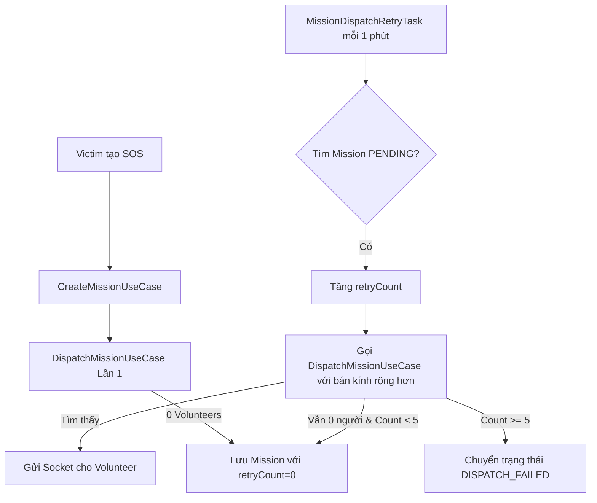

# Kế hoạch triển khai Auto-Retry Dispatch cho Mission

## 1. Mục tiêu
Đảm bảo các yêu cầu cứu hộ (SOS) và tiếp tế (AID) không bị bỏ lỡ khi không có Volunteer online tại thời điểm tạo nhiệm vụ. Hệ thống sẽ tự động tìm kiếm lại theo chu kỳ và mở rộng bán kính cho đến khi tìm được người nhận hoặc đạt giới hạn tối đa.

## 2. Luồng xử lý (Workflow)
1. **Khởi tạo**: Khi Mission được tạo, `retryCount` mặc định là 0.
2. **Quét định kỳ**: Một Task ngầm chạy mỗi 60 giây tìm các Mission có:
   - Status = `PENDING`
   - `retryCount` < 5
   - Thời gian từ lần dispatch cuối cùng > 45 giây.
3. **Mở rộng bán kính**: 
   - Lần 1-2: Tìm k=5 (H3).
   - Lần 3-4: Tìm k=10 (H3).
   - Lần 5: Tìm k=20 (H3).
4. **Kết thúc**: Nếu sau 5 lần vẫn không có ai, chuyển trạng thái sang `DISPATCH_FAILED` và gửi thông báo cho Ban quản trị.

## 3. Các file cần chỉnh sửa và vai trò

### 3.1. Module Mission
- `Mission.java`: 
    - Thêm `@Column int retryCount`
    - Thêm `@Column Instant lastDispatchAt`
- `MissionStatus.java`: 
    - Thêm enum `DISPATCH_FAILED`
- `MissionJpaRepository.java`:
    - Thêm phương thức `findMissionsForRetry(Instant threshold, List<MissionStatus> statuses, int maxRetry)`

### 3.2. Module Volunteer
- `FindNearbyVolunteersUseCase.java`: 
    - Cập nhật logic nhận thêm tham số `radiusStep` để điều chỉnh vòng quét H3 linh hoạt thay vì fix cứng `{2, 5, 10}`.

### 3.3. Module Dispatch (Logic chính)
- `DispatchMissionUseCase.java`: 
    - Cập nhật thông tin `lastDispatchAt` và tăng `retryCount` mỗi khi thực hiện điều phối.

### 3.4. Hệ thống mới (Task)
- **NEW** `MissionDispatchRetryTask.java`: 
    - Sử dụng `@Scheduled(fixedDelay = 60000)`
    - Gọi `DispatchMissionUseCase` cho từng Mission cần xử lý lại.

## 4. Kết nối logic

## 5. Công nghệ & Thư viện
- **Spring Scheduler**: Có sẵn trong Spring Boot, không cần cài thêm.
- **H3 Java**: Đã có sẵn trong dự án để xử lý mở rộng vùng tìm kiếm.
- **GraphHopper**: Dùng để tính toán lại ETA chính xác hơn khi phạm vi mở rộng.

---
**Ghi chú**: Cần lưu ý việc tránh gửi thông báo trùng lặp (Spam) cho cùng một Volunteer đã nhận được thông báo ở vòng trước nhưng chưa phản hồi.
